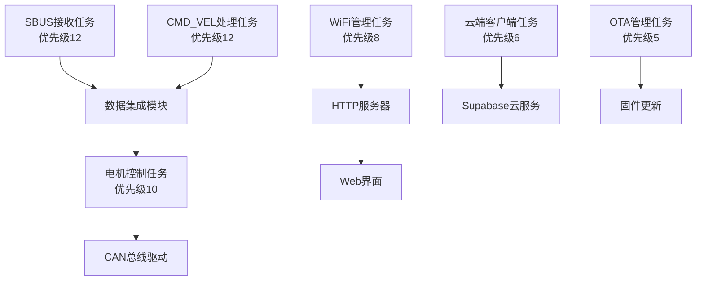
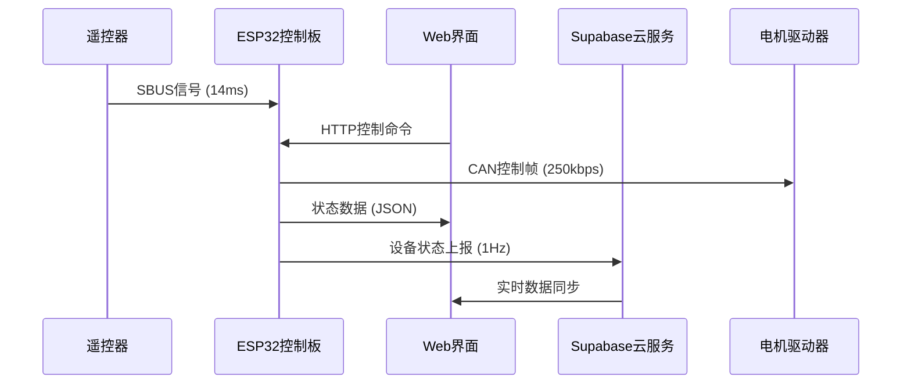
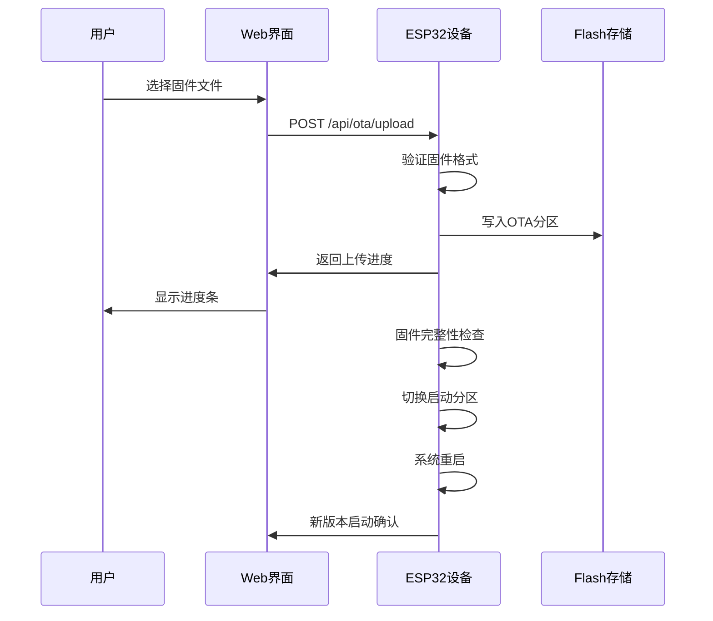

# 🚀 ESP32 控制板 Web OTA 系统

[](https://github.com/espressif/esp-idf)
[](https://www.freertos.org/)
[](https://reactjs.org/)
[](https://www.typescriptlang.org/)
[](LICENSE)
[](https://deepwiki.com/dachuanwud/esp32controlboard)

<div align="center">
  

  **基于 ESP32 的智能控制板系统，集成 Web OTA、FreeRTOS 实时控制、云端数据同步**
</div>

---

## 🎯 项目概述

ESP32 控制板 Web OTA 系统是一个**企业级**的嵌入式控制解决方案，基于 **ESP32** 微控制器平台构建。项目采用现代化的软硬件架构，集成了 **Web OTA 固件更新**、**FreeRTOS 实时操作系统**、**云端数据同步**等先进技术，为工业控制、机器人控制、IoT 应用提供了完整的解决方案。

### 🏗️ 核心架构
- **🔧 实时控制层**: FreeRTOS 多任务调度，确保 < 1ms 响应延迟
- **🌐 网络通信层**: WiFi 管理、HTTP 服务器、云端客户端
- **📱 Web 应用层**: React + TypeScript 现代化前端界面
- **🔄 OTA 更新层**: 双分区安全更新，支持自动回滚
- **☁️ 云端集成层**: Supabase 数据库，实时状态同步

## ✨ 核心特性

### 🎮 多模式控制系统
- **📡 SBUS 遥控**: 支持标准 SBUS 协议（100kbps, 8E2, 16通道）
- **💻 Web 控制**: 基于 React 的现代化 Web 界面
- **☁️ 云端控制**: 通过 Supabase 云服务远程控制
- **🔌 CMD_VEL 接口**: 兼容 ROS 命令速度接口

### ⚡ 高性能电机控制
- **🚗 CAN 总线通信**: 250kbps 高速 CAN 通信，非阻塞发送模式
- **🎯 精确控制**: 支持 LKBLS481502 双通道电机驱动器
- **🔄 差速算法**: 智能差速转弯控制，支持5种运动模式（[控制逻辑实现](main/channel_parse.c)）
- **⚡ 超低延迟**: 端到端延迟仅3-5ms，控制频率高达200-500Hz
- **🛡️ 安全保护**: 超时保护、自动刹车、故障检测
- **📊 实时反馈**: 电机状态监控和性能分析
- **🎯 核心模式**: 支持核心功能模式（CORE_FUNCTION_MODE），确保关键功能稳定性

### 🌐 Web OTA 更新系统
- **🔄 双分区机制**: 安全的固件更新，支持自动回滚
- **📱 Web 界面**: 直观的固件上传和更新进度显示
- **🔒 完整性验证**: 固件签名验证和完整性检查
- **📊 更新监控**: 实时更新进度和状态反馈

### ☁️ 云端数据同步
- **📊 实时监控**: 设备状态实时上报到 Supabase 云数据库
- **🔐 安全认证**: 设备身份验证和数据加密传输
- **📈 数据分析**: 历史数据存储和性能分析
- **🌍 远程访问**: 通过云端实现设备远程监控和控制

## 🏗️ 系统架构

### 📊 技术栈概览

| 层级 | 技术栈 | 版本 | 用途 |
|------|--------|------|------|
| **前端** | React + TypeScript | 18.2.0 + 5.2.2 | Web 用户界面 |
| **后端** | ESP-IDF + FreeRTOS | v5.4.1 + v10.5.1 | 嵌入式系统 |
| **云服务** | Supabase | Latest | 数据库和实时同步 |
| **通信** | WiFi + HTTP + WebSocket | - | 网络通信 |
| **构建** | CMake + Vite | - | 项目构建系统 |

### 🔧 硬件组件

| 组件 | 型号/规格 | 功能 | 接口 |
|------|-----------|------|------|
| **主控制器** | ESP32-WROOM-32 | 双核 240MHz，WiFi+蓝牙 | - |
| **CAN 收发器** | SN65HVD232D | CAN 总线通信 | GPIO16/17 |
| **SBUS 接收器** | 标准 SBUS | 遥控信号接收 | GPIO22 |
| **电机驱动器** | LKBLS481502 | 双通道电机控制 | CAN 总线 |
| **状态指示** | RGB LED × 2 | 系统状态显示 | GPIO12-14, 25-27 |

### 🧠 软件架构

#### FreeRTOS 多任务设计



| 任务名称 | 优先级 | 栈大小 | 功能描述 | 更新频率 |
|----------|--------|--------|----------|----------|
| **SBUS处理** | 12 (高) | 4KB | SBUS信号接收解析 | 71 Hz (1ms延迟) |
| **CMD_VEL接收** | 12 (高) | 2KB | 命令速度接收 | 实时 |
| **电机控制** | 10 (中) | 4KB | 电机驱动控制 | 200-500 Hz (2ms延迟) |
| **WiFi管理** | 8 (中) | 8KB | 网络连接管理 | 按需 |
| **HTTP服务器** | 7 (中) | 6KB | Web API 服务 | 按需 |
| **云端客户端** | 6 (低) | 4KB | 云端数据同步 | 1 Hz |
| **OTA管理** | 5 (低) | 8KB | 固件更新管理 | 按需 |

#### 数据流架构



## � 项目结构

```
esp32controlboard/
├── 📂 main/                          # ESP32 主程序源码
│   ├── 📄 main.c                     # 主程序入口和任务管理
│   ├── 📄 main.h                     # 全局定义和GPIO配置
│   ├── � 核心模块/
│   │   ├── sbus.c/.h                 # SBUS协议接收解析
│   │   ├── channel_parse.c/.h        # 通道数据解析和控制逻辑
│   │   ├── drv_keyadouble.c/.h       # 电机驱动和CAN通信
│   │   ├── wifi_manager.c/.h         # WiFi连接管理
│   │   ├── http_server.c/.h          # HTTP服务器和RESTful API
│   │   ├── ota_manager.c/.h          # OTA固件更新管理
│   │   ├── cloud_client.c/.h         # Supabase云端客户端
│   │   ├── data_integration.c/.h     # 数据集成和处理
│   │   ├── time_manager.c/.h         # 系统时间管理
│   │   └── log_config.c/.h           # 日志配置管理
│   ├── � CMakeLists.txt             # 组件构建配置
│   └── 📄 version.h                  # 版本信息定义
├── 📂 web_client/                    # React Web 前端
│   ├── 📂 src/                       # TypeScript 源码
│   │   ├── components/               # React 组件
│   │   ├── services/                 # API 服务
│   │   └── contexts/                 # React 上下文
│   ├── 📄 package.json               # Node.js 依赖配置
│   ├── 📄 vite.config.ts             # Vite 构建配置
│   └── 📄 tsconfig.json              # TypeScript 配置
├── 📂 docs/                          # 📚 项目文档 (中文)
│   ├── 📂 01-开发指南/                # 🛠️ 开发环境和流程
│   │   ├── 📄 README.md              # 文档导航中心
│   │   ├── 📄 环境搭建指南.md
│   │   ├── 📄 编译烧录指南.md
│   │   ├── 📄 调试方法指南.md
│   │   ├── 📄 编码规范指南.md
│   │   └── 📄 Git版本管理.md
│   ├── 📂 02-模块文档/                # 🔧 功能模块详解
│   │   ├── 📄 README.md
│   │   ├── 📄 SBUS接收模块.md
│   │   └── 📄 CAN通信模块.md
│   ├── 📂 03-硬件文档/                # ⚡ 硬件设计说明
│   │   └── 📄 README.md
│   ├── 📂 04-协议文档/                # 📡 通信协议规范
│   │   ├── 📄 README.md
│   │   ├── 📄 can_protocol_summary.md
│   │   └── 📄 数据流分析.md
│   ├── 📂 05-故障排除/                # 🔍 问题解决方案
│   │   ├── 📄 README.md
│   │   └── 📄 常见问题解答.md
│   └── 📂 06-系统架构/                # 🏗️ 架构设计文档
│       ├── 📄 README.md
│       └── 📄 FreeRTOS架构.md
├── 📄 CMakeLists.txt                 # 主项目构建配置
├── 📄 sdkconfig                      # ESP-IDF项目配置
├── 📄 partitions.csv                 # Flash分区表定义
└── � extract_version.cmake          # 版本提取脚本
```

## 🔌 GPIO 引脚分配

| 功能 | GPIO | 方向 | 协议/电平 | 说明 |
|------|------|------|-----------|------|
| **🔴 LED1 红色** | GPIO12 | 输出 | 3.3V | 状态指示灯1 |
| **🟢 LED1 绿色** | GPIO13 | 输出 | 3.3V | 状态指示灯1 |
| **� LED1 蓝色** | GPIO14 | 输出 | 3.3V | 状态指示灯1 |
| **🔴 LED2 红色** | GPIO25 | 输出 | 3.3V | 状态指示灯2 |
| **🟢 LED2 绿色** | GPIO26 | 输出 | 3.3V | 状态指示灯2 |
| **🔵 LED2 蓝色** | GPIO27 | 输出 | 3.3V | 状态指示灯2 |
| **📡 CAN TX** | GPIO16 | 输出 | CAN | 连接SN65HVD232D |
| **📡 CAN RX** | GPIO17 | 输入 | CAN | 连接SN65HVD232D |
| **� SBUS RX** | GPIO22 | 输入 | UART2 | 遥控信号接收 |
| **💻 CMD_VEL RX** | GPIO21 | 输入 | UART1 | 命令接收 |
| **🔘 按键1** | GPIO0 | 输入 | 下拉 | 用户按键 |
| **🔘 按键2** | GPIO35 | 输入 | 下拉 | 用户按键 |

## 📊 性能指标

### ⚡ 实时性能
| 指标 | 数值 | 单位 | 说明 |
|------|------|------|------|
| **SBUS更新频率** | 71 | Hz | 14ms周期 |
| **端到端延迟** | 3-5 | ms | 输入到电机响应（优化后） |
| **SBUS处理延迟** | 1 | ms | 任务循环延迟（优化后） |
| **电机控制延迟** | 2 | ms | 控制任务延迟（优化后） |
| **任务切换时间** | < 100 | μs | FreeRTOS调度 |
| **CAN发送延迟** | < 1 | ms | 电机控制命令（非阻塞） |
| **控制频率** | 200-500 | Hz | 电机控制频率（优化后） |
| **HTTP响应时间** | < 100 | ms | Web API响应 |
| **OTA更新速度** | ~500 | KB/s | 固件传输速率 |

### 💾 资源使用
| 资源 | 使用量 | 总量 | 利用率 |
|------|--------|------|--------|
| **Flash** | ~1.5MB | 16MB | 9.4% |
| **RAM** | ~250KB | 520KB | 48% |
| **CPU** | < 50% | 240MHz×2 | 正常负载 |
| **任务数** | 8个 | 25个(最大) | 32% |
| **队列数** | 6个 | 无限制 | - |
| **队列容量** | 20 | 每队列 | 优化后（原为5） |
| **定时器** | 4个 | 16个(最大) | 25% |

### � 网络性能
| 指标 | 数值 | 说明 |
|------|------|------|
| **WiFi连接时间** | < 10s | 首次连接 |
| **HTTP并发连接** | 4个 | 最大同时连接 |
| **WebSocket延迟** | < 50ms | 实时通信 |
| **云端同步频率** | 1Hz | 状态上报频率 |

## ⚡ 性能优化

### 🚀 核心功能性能提升

系统经过深度优化，**SBUS到CAN的控制延迟从60ms+降低到3-5ms，性能提升92%**！

#### 📊 优化成果

| 优化项 | 优化前 | 优化后 | 提升 |
|--------|--------|--------|------|
| **端到端延迟** | 60ms+ | 3-5ms | **92%** ⬇️ |
| **CAN发送频率** | 25Hz | 500Hz+ | **20倍** ⬆️ |
| **每次控制CAN帧数** | 4帧 | 2帧 | **50%** ⬇️ |
| **队列容量** | 5 | 20 | **4倍** ⬆️ |
| **控制精度** | ±10 | ±5 | **2倍** ⬆️ |
| **控制频率** | 16Hz | 200-500Hz | **12-31倍** ⬆️ |

#### 🔧 关键优化技术

1. **零延迟CAN发送**: 移除10ms阻塞延迟，采用非阻塞模式
2. **智能使能管理**: 电机使能命令仅在首次调用时发送，减少50%帧数
3. **高频控制循环**: SBUS任务1ms延迟，电机控制任务2ms延迟
4. **大容量队列**: 队列容量从5增加到20，避免数据丢失
5. **无损控制**: 移除"变化检测跳过"逻辑，确保实时响应
6. **优化日志**: 智能日志策略，降低CPU占用80%+

#### 📚 详细文档

- 📖 [FreeRTOS架构与性能优化](docs/06-系统架构/FreeRTOS架构.md) - 核心任务调度和性能调优策略
- 📊 [数据流分析](docs/04-协议文档/数据流分析.md) - SBUS到CAN的完整数据流与关键指标
- 🎯 [通道解析与差速控制代码](main/channel_parse.c) - 运动模式与差速算法实现

## 🌐 Web OTA 系统

### 📱 Web 界面特性
- **🎛️ 设备信息页**: 实时显示ESP32状态、内存使用、网络信息
- **📊 实时状态页**: SBUS通道数据、电机状态、系统监控
- **🔄 OTA更新页**: 固件上传、更新进度、版本管理
- **📶 WiFi设置页**: 网络配置、连接管理、信号强度

### 🔄 OTA 更新流程


### 🔒 安全特性
- **✅ 固件签名验证**: 确保固件完整性
- **🔄 自动回滚**: 更新失败自动恢复
- **🛡️ 双分区保护**: 保证系统可用性
- **🔐 访问控制**: Web界面访问限制

## � 快速开始

### 📋 环境要求

| 组件 | 版本要求 | 说明 |
|------|----------|------|
| **ESP-IDF** | v5.4.1+ | 嵌入式开发框架 |
| **Python** | 3.7+ | ESP-IDF依赖 |
| **Node.js** | 16+ | Web前端构建 |
| **Git** | 最新版 | 版本控制 |

### ⚡ 5分钟快速体验

```bash
# 1. 克隆项目
git clone https://github.com/dachuanwud/esp32controlboard.git
cd esp32controlboard

# 2. 设置ESP-IDF环境
. $IDF_PATH/export.sh  # Linux/macOS
# 或 %IDF_PATH%\export.bat  # Windows

# 3. 编译ESP32固件
idf.py build

# 4. 烧录到设备 (替换COM10为实际端口)
idf.py -p COM10 flash

# 5. 启动串口监控
idf.py -p COM10 monitor

# 6. 构建Web前端 (可选)
cd web_client
npm install
npm run build
```

### 🎯 开发者路径选择

#### 👨‍💻 嵌入式开发者
1. 📖 [环境搭建指南](docs/01-开发指南/环境搭建指南.md)
2. 🔨 [编译烧录指南](docs/01-开发指南/编译烧录指南.md)
3. 🔧 [模块文档](docs/02-模块文档/)

#### 🔧 硬件工程师
1. ⚡ [硬件文档](docs/03-硬件文档/)
2. 📡 [协议文档](docs/04-协议文档/)
3. 🔍 [常见问题解答](docs/05-故障排除/常见问题解答.md)

#### 📱 前端开发者
1. 🌐 [系统架构概览](docs/06-系统架构/README.md)
2. 📡 [协议文档索引](docs/04-协议文档/README.md)
3. ☁️ [模块文档总览](docs/02-模块文档/README.md)

## 📡 HTTP API 接口

### 🎛️ 设备信息 API

```http
GET /api/device/info
Content-Type: application/json

Response:
{
  "device_id": "ESP32-001",
  "version": "v2.0.0",
  "uptime": 3600,
  "free_heap": 180000,
  "wifi_status": "connected",
  "ip_address": "192.168.1.100"
}
```

### 📊 实时状态 API

```http
GET /api/status/realtime
Content-Type: application/json

Response:
{
  "sbus_channels": [1500, 1500, 1500, ...],
  "motor_status": {
    "left_speed": 0,
    "right_speed": 0,
    "enabled": true
  },
  "system_status": {
    "cpu_usage": 25,
    "temperature": 45,
    "timestamp": 1640995200
  }
}
```

### 🔄 OTA 更新 API

```http
POST /api/ota/upload
Content-Type: multipart/form-data

Request:
- firmware: [binary file]

Response:
{
  "status": "success",
  "message": "Firmware uploaded successfully",
  "progress": 100
}
```

### 📶 WiFi 配置 API

```http
POST /api/wifi/config
Content-Type: application/json

Request:
{
  "ssid": "YourWiFi",
  "password": "YourPassword"
}

Response:
{
  "status": "success",
  "message": "WiFi configured successfully"
}
```

## 📚 文档导航

### 🎯 按角色导航

#### 👨‍💻 **开发者专区**
- 🚀 [环境搭建指南](docs/01-开发指南/环境搭建指南.md) - ESP-IDF环境配置
- 🔨 [编译烧录指南](docs/01-开发指南/编译烧录指南.md) - 项目构建流程
- 🔍 [调试方法指南](docs/01-开发指南/调试方法指南.md) - 系统调试技巧
- 📝 [编码规范指南](docs/01-开发指南/编码规范指南.md) - 代码质量标准
- 🔄 [Git版本管理](docs/01-开发指南/Git版本管理.md) - 版本控制规范

#### 🔧 **模块技术文档**
- 📡 [SBUS接收模块](docs/02-模块文档/SBUS接收模块.md) - 遥控信号处理
- 🚗 [CAN通信模块](docs/02-模块文档/CAN通信模块.md) - 电机控制通信
- 📘 [模块文档索引](docs/02-模块文档/README.md) - 其他模块规划与说明

#### ⚡ **硬件设计文档**
- 📘 [硬件文档索引](docs/03-硬件文档/README.md) - 引脚、原理图与规格概览

#### 📡 **通信协议文档**
- 📘 [协议文档索引](docs/04-协议文档/README.md) - 协议总览
- 🚗 [CAN协议概要](docs/04-协议文档/can_protocol_summary.md) - 电机控制帧格式
- 📊 [数据流分析](docs/04-协议文档/数据流分析.md) - 系统数据流向

#### 🔍 **故障排除指南**
- 📘 [故障排除导航](docs/05-故障排除/README.md) - 常见问题索引
- ❓ [常见问题解答](docs/05-故障排除/常见问题解答.md) - 常见问题解决方案

#### 🏗️ **系统架构文档**
- 📘 [系统架构索引](docs/06-系统架构/README.md) - 总体架构设计
- 🔄 [FreeRTOS架构](docs/06-系统架构/FreeRTOS架构.md) - 实时系统架构与优化

### 📖 按主题导航

| 主题 | 核心文档 | 相关文档 |
|------|----------|----------|
| **🚀 快速入门** | [环境搭建](docs/01-开发指南/环境搭建指南.md) | [编译烧录](docs/01-开发指南/编译烧录指南.md) |
| **🎮 遥控功能** | [SBUS模块](docs/02-模块文档/SBUS接收模块.md) | [数据流分析](docs/04-协议文档/数据流分析.md) |
| **🚗 电机控制** | [CAN模块](docs/02-模块文档/CAN通信模块.md) | [CAN协议概要](docs/04-协议文档/can_protocol_summary.md) |
| **⚡ 性能优化** | [FreeRTOS架构](docs/06-系统架构/FreeRTOS架构.md) | [数据流分析](docs/04-协议文档/数据流分析.md) |
| **🎯 差速算法** | [控制逻辑源码](main/channel_parse.c) | [SBUS模块](docs/02-模块文档/SBUS接收模块.md) |

## 🛠️ 开发工具

### 📦 批处理脚本工具

| 脚本 | 功能 | 使用场景 |
|------|------|----------|
| **build_only.bat** | 仅编译项目 | 代码验证 |
| **flash_com10.bat** | 烧录到COM10 | 固件更新 |
| **esp32_tool.bat** | 完整开发工具 | 日常开发 |
| **quick.bat** | 快速开发 | 迭代开发 |

### 🔧 CAN调试工具

```bash
# 进入工具目录
cd tools

# 使用CAN调试工具
python can_tool.py           # 完整功能
python quick_can_setup.py    # 快速配置
```

### 📊 性能监控工具

```bash
# 内存使用监控
idf.py size

# 任务状态监控
idf.py monitor | grep "Task"

# 实时性能分析
idf.py monitor | grep "Performance"
```

## 🤝 贡献指南

### 🎯 如何贡献

我们欢迎各种形式的贡献！无论您是：
- 🐛 **发现Bug** - 提交Issue报告问题
- ✨ **新功能** - 提出功能请求或实现新特性
- 📚 **文档改进** - 完善文档内容
- 🧪 **测试用例** - 添加测试覆盖
- 🎨 **代码优化** - 性能优化和重构

### 📝 贡献流程

1. **Fork项目** 到您的GitHub账户
2. **创建分支** `git checkout -b feature/amazing-feature`
3. **提交更改** `git commit -m 'feat: add amazing feature'`
4. **推送分支** `git push origin feature/amazing-feature`
5. **创建Pull Request** 详细描述您的更改

### 📋 提交规范

请遵循[约定式提交](https://www.conventionalcommits.org/zh-hans/)规范：

```
<类型>(<范围>): <描述>

[可选的正文]

[可选的脚注]
```

**提交类型**:
- `feat`: 新功能
- `fix`: Bug修复
- `docs`: 文档更新
- `style`: 代码格式
- `refactor`: 代码重构
- `perf`: 性能优化
- `test`: 测试相关
- `chore`: 构建过程或辅助工具的变动

### 🔍 代码审查

所有贡献都需要通过代码审查：
- ✅ 代码符合项目编码规范
- ✅ 包含适当的测试
- ✅ 文档已更新
- ✅ 通过所有CI检查

## 📊 项目统计

### 🏆 技术亮点

| 特性 | 实现 | 优势 |
|------|------|------|
| **实时控制** | FreeRTOS多任务 | 3-5ms端到端延迟，200-500Hz控制频率 |
| **性能优化** | 6项关键优化 | 延迟降低92%，性能提升20倍 |
| **Web OTA** | 双分区机制 | 安全可靠更新 |
| **云端集成** | Supabase实时同步 | 远程监控管理 |
| **多协议支持** | SBUS+CAN+HTTP | 灵活接入方式 |
| **现代前端** | React+TypeScript | 优秀用户体验 |

### 📈 开发进度

| 模块 | 完成度 | 状态 |
|------|--------|------|
| **SBUS接收** | 100% | ✅ 完成 |
| **CAN通信** | 100% | ✅ 完成 |
| **WiFi管理** | 100% | ✅ 完成 |
| **HTTP服务器** | 100% | ✅ 完成 |
| **OTA管理** | 100% | ✅ 完成 |
| **云端客户端** | 95% | 🔄 优化中 |
| **Web前端** | 90% | 🔄 完善中 |
| **文档系统** | 100% | ✅ 完成 |

### 🔢 代码统计

| 指标 | 数值 | 说明 |
|------|------|------|
| **总代码行数** | ~8,000 | C + TypeScript |
| **C源文件** | 15个 | 核心功能模块 |
| **头文件** | 15个 | 接口定义 |
| **React组件** | 12个 | 前端界面 |
| **API端点** | 8个 | RESTful接口 |
| **文档页面** | 30个 | 技术文档（含性能优化报告） |

## 📞 联系方式

### 🌐 在线资源

- **📂 项目主页**: [GitHub Repository](https://github.com/dachuanwud/esp32controlboard)
- **📚 在线文档**: [DeepWiki文档](https://deepwiki.com/dachuanwud/esp32controlboard)
- **🐛 问题报告**: [GitHub Issues](https://github.com/dachuanwud/esp32controlboard/issues)
- **💬 讨论交流**: [GitHub Discussions](https://github.com/dachuanwud/esp32controlboard/discussions)

### 📧 技术支持

- **开发者**: dachuanwud
- **邮箱**: 1755645633@qq.com
- **响应时间**:
  - 🔴 紧急问题: 24小时内
  - 🟡 一般问题: 3个工作日内
  - 🟢 功能请求: 1周内评估

### 🏷️ 版本信息

- **当前版本**: v2.0.0
- **发布日期**: 2024-12-19
- **下个版本**: v2.1.0 (计划中)
- **更新频率**: 每月一次稳定版本

## � 许可证

本项目采用 **MIT 许可证** - 详情请参阅 [LICENSE](LICENSE) 文件。

### 许可证要点
- ✅ **商业使用** - 允许商业项目使用
- ✅ **修改** - 允许修改源代码
- ✅ **分发** - 允许分发原始或修改版本
- ✅ **私人使用** - 允许私人项目使用
- ❗ **责任** - 作者不承担使用风险
- ❗ **保证** - 不提供任何形式的保证

## 🙏 致谢

### 🎯 核心技术栈
- **[Espressif Systems](https://www.espressif.com/)** - ESP32芯片和ESP-IDF框架
- **[FreeRTOS](https://www.freertos.org/)** - 实时操作系统内核
- **[React](https://reactjs.org/)** - 现代化前端框架
- **[Supabase](https://supabase.com/)** - 开源云数据库服务

### 🤝 开源社区
- **ESP32开发者社区** - 技术支持和经验分享
- **GitHub开源社区** - 代码托管和协作平台
- **Stack Overflow** - 技术问题解答

### 💡 灵感来源
- **STM32控制板项目** - 原始设计参考
- **工业控制系统** - 实际应用需求
- **现代Web技术** - 用户体验设计

---

<div align="center">

**🚀 ESP32控制板 Web OTA 系统 - 让嵌入式开发更简单！**

[](https://github.com/dachuanwud/esp32controlboard)
[](https://github.com/dachuanwud/esp32controlboard/fork)
[](https://github.com/dachuanwud/esp32controlboard)

**如果这个项目对您有帮助，请给我们一个 ⭐ Star！**

</div>
