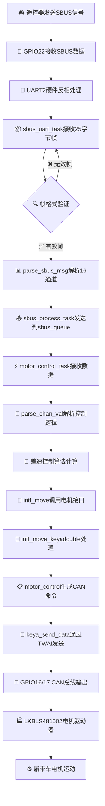
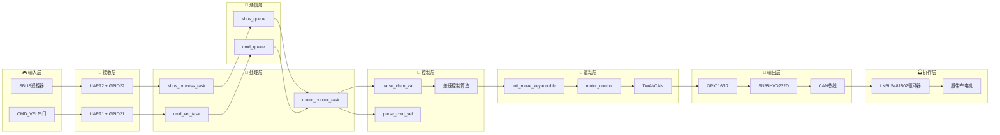

# ESP32 控制板


## 项目概述

ESP32 控制板是一个基于 ESP32 微控制器平台的复杂电机控制系统，利用 ESP-IDF 框架和 FreeRTOS 实时操作系统构建。本项目复制了基于 STM32 的控制板功能，为遥控和自主电机控制应用提供了一个稳健的解决方案。

系统采用多任务架构，通过 FreeRTOS 队列实现任务间通信，确保实时响应性和系统稳定性。它支持通过 SBUS 协议进行遥控，也支持通过命令接口进行编程控制。

## 主要特性

- **双输入控制**：
  - SBUS 接收器输入，用于遥控器控制
  - 命令速度（cmd_vel）接口，用于编程控制

- **电机控制**：
  - 通过 CAN 总线（TWAI）与 LKBLS481502 双通道电机驱动器接口
  - 可配置的电机速度和方向控制
  - 带超时保护的自动刹车系统

- **实时性能**：
  - 基于 FreeRTOS 的任务架构
  - 基于优先级的调度
  - 基于队列的任务间通信

- **系统监控**：
  - LED 状态指示
  - 通过串行接口进行全面日志记录
  - 看门狗保护

## 系统架构

### 硬件组件

- **ESP32 微控制器**：带集成 Wi-Fi 和蓝牙的双核处理器
- **SBUS 接收器**：用于遥控输入
- **CAN 收发器**：与电机驱动器接口所需（ESP32 上不包含）
- **LKBLS481502**：带 CAN 接口的双通道电机驱动器

### 软件架构

#### 多任务设计

| 任务 | 优先级 | 堆栈大小 | 描述 |
|------|----------|------------|-------------|
| SBUS 处理 | 高 (12) | 4096 字节 | 接收并解析来自遥控接收器的 SBUS 信号 |
| CMD_VEL 接收 | 高 (12) | 2048 字节 | 接收并解析命令速度消息 |
| 电机控制 | 中 (10) | 4096 字节 | 处理命令并控制电机 |
| 状态监控 | 低 (5) | 2048 字节 | 监控系统状态并更新 LED 指示器 |

#### 任务间通信

- **SBUS 队列**：将通道数据从 SBUS 任务传输到电机控制任务
- **CMD 队列**：将电机命令从 CMD_VEL 任务传输到电机控制任务
- **优先级管理**：确保关键任务在需要时获得 CPU 时间

#### 控制流程

1. 通过 SBUS 或 CMD_VEL 接口接收输入信号
2. 解析信号并转换为电机命令
3. 对电机命令进行优先级排序（CMD_VEL 优先于 SBUS）
4. 通过 CAN 总线将命令发送到电机驱动器
5. 持续监控系统状态并指示

## 📊 详细信息流程图

### 🔄 从SBUS接收到CAN发送的完整数据流



### 🏗️ 系统架构层次



### 📋 详细数据流程说明

#### 🎯 SBUS数据流程 (主要控制路径)

1. **📡 信号接收阶段**
   - 遥控器发送SBUS信号 (100kbps, 8E2, 反相逻辑)
   - ESP32 GPIO22接收信号
   - UART2硬件自动反相处理 (`UART_SIGNAL_RXD_INV`)

2. **📦 数据解析阶段**
   - `sbus_uart_task` 接收25字节SBUS帧
   - 帧格式验证: `[0xF0] + [data1-22] + [flags] + [0x00]`
   - `parse_sbus_msg` 解析16个11位通道 (0-2047范围)
   - 通道值映射: `(raw_val - 282) * 5 / 8 + 1050` → 1050-1950范围

3. **🔄 任务通信阶段**
   - `sbus_process_task` 将解析后的通道数据发送到 `sbus_queue`
   - 队列大小: 5个元素，满时覆盖旧数据
   - 任务优先级: 12 (高优先级)

4. **🎮 控制逻辑阶段**
   - `motor_control_task` 从队列接收数据
   - `parse_chan_val` 解析关键通道:
     - 通道0: 左右控制 (右>0)
     - 通道2: 前后控制 (前>0)
     - 通道3: 单手模式左右控制
     - 通道6: 单手模式开关 (1950=启用)
     - 通道7: 低速模式开关 (1950=启用)

5. **🧮 差速算法阶段**
   - `chg_val` 函数: `(val-1500)/9*2` 映射到 -100~100
   - 差速控制逻辑:
     - 停止: `intf_move(0, 0)`
     - 原地转向: `intf_move(sp_lr, -sp_lr)`
     - 直行: `intf_move(sp_fb, sp_fb)`
     - 差速转弯: `cal_offset` 计算内侧减速

6. **🚗 电机驱动阶段**
   - `intf_move_keyadouble` 接收左右电机速度 (-100~100)
   - 参数验证和刹车标志更新
   - 调用 `motor_control` 生成CAN命令

7. **📡 CAN通信阶段**
   - 使能命令: `23 0D 20 01/02 00 00 00 00`
   - 速度命令: `23 00 20 01/02 [32位速度值]`
   - 速度转换: `speed * 100` (-100~100 → -10000~10000)
   - TWAI发送: 扩展帧29位ID, 8字节数据, 250kbps

8. **🔌 硬件输出阶段**
   - GPIO16 (TX) → SN65HVD232D D引脚
   - GPIO17 (RX) → SN65HVD232D R引脚
   - CAN总线差分信号输出

9. **⚙️ 电机执行阶段**
   - LKBLS481502双通道电机驱动器接收CAN命令
   - A路(左侧电机) ID=0x01, B路(右侧电机) ID=0x02
   - 履带车差速运动实现

#### 🔄 CMD_VEL数据流程 (优先级路径)

1. **📡 串口接收**: UART1 GPIO21接收5字节命令帧
2. **📦 帧解析**: `[0xFF] [0x02] [left_speed] [right_speed] [0x00]`
3. **⚡ 优先处理**: CMD_VEL命令优先于SBUS，1秒超时
4. **🚗 直接控制**: `parse_cmd_vel` 直接调用 `intf_move`

#### 🎛️ 任务优先级管理

- **SBUS处理任务**: 优先级12 (高) - 实时性要求
- **CMD_VEL任务**: 优先级12 (高) - 优先控制
- **电机控制任务**: 优先级10 (中) - 核心控制逻辑
- **状态监控任务**: 优先级5 (低) - 系统监控

## 硬件连接

### GPIO 引脚分配

| 功能 | GPIO 引脚 | 描述 |
|----------|----------|-------------|
| **状态指示器** |
| LED_BLUE_PIN | GPIO_NUM_2 | 系统状态指示蓝色 LED |
| **电机控制** |
| LEFT_EN_PIN | GPIO_NUM_4 | 左电机使能 |
| LEFT_DIR_PIN | GPIO_NUM_5 | 左电机方向 |
| RIGHT_DIR_PIN | GPIO_NUM_18 | 右电机方向 |
| RIGHT_EN_PIN | GPIO_NUM_19 | 右电机使能 |
| LEFT_BK_PIN | GPIO_NUM_21 | 左电机刹车 |
| RIGHT_BK_PIN | GPIO_NUM_22 | 右电机刹车 |
| **通信** |
| UART_DEBUG | UART0 | 调试串口（默认引脚） |
| UART_SBUS | UART2 (RX: GPIO22) | SBUS 接收器输入（使用UART_INVERT_RXD） |
| UART_CMD | UART1 (RX: GPIO21) | 命令速度输入 |
| **CAN 总线 (TWAI)** |
| CAN_TX | GPIO_NUM_16 | CAN 总线发送（连接到SN65HVD232D的D引脚） |
| CAN_RX | GPIO_NUM_17 | CAN 总线接收（连接到SN65HVD232D的R引脚） |

### CAN 总线配置

- **协议**：TWAI（Two-Wire Automotive Interface，ESP32 的 CAN 实现）
- **波特率**：250 Kbps
- **模式**：正常模式
- **过滤器**：接受所有消息
- **所需外部硬件**：CAN 收发器（使用SN65HVD232D）

## 项目结构

```
esp32controlboard/
├── main/                     # ESP32主程序源码
│   ├── CMakeLists.txt        # 组件 makefile
│   ├── main.c                # 主应用程序入口点
│   ├── main.h                # 全局定义和配置
│   ├── sbus.c                # SBUS 协议实现
│   ├── sbus.h                # SBUS 接口定义
│   ├── channel_parse.c       # 通道值解析和运动控制
│   ├── channel_parse.h       # 通道解析接口
│   ├── drv_keyadouble.c      # 电机驱动实现
│   └── drv_keyadouble.h      # 电机驱动接口
├── tools/                    # 🛠️ CAN工具集（新增）
│   ├── can_tool.py           # 完整功能CAN工具
│   ├── can_detector.py       # CAN设备检测模块
│   ├── quick_can_setup.py    # 快速CAN配置工具
│   ├── can_tool.bat          # Windows启动脚本
│   ├── test_can_tools.py     # 工具测试脚本
│   ├── requirements.txt      # Python依赖包
│   └── README.md             # 工具使用说明
├── docs/                     # 📚 项目文档
│   ├── development/          # 开发指南
│   ├── modules/              # 模块说明
│   ├── hardware/             # 硬件文档
│   ├── protocols/            # 协议文档
│   └── troubleshooting/      # 故障排除
├── CMakeLists.txt            # 项目 makefile
├── build_only.bat            # 仅编译脚本
├── flash_com10.bat           # 烧录脚本
└── README.md                 # 项目文档
```

## 🛠️ CAN工具集

项目新增了专业的CAN设备检测和配置工具，用于测试和验证CAN通信：

### 快速使用CAN工具

```bash
# 进入工具目录
cd tools

# Windows用户（推荐）
can_tool.bat

# 或直接运行Python脚本
python quick_can_setup.py    # 快速配置模式
python can_tool.py           # 完整功能模式
```

### CAN工具功能

- **🔍 自动检测**: 扫描并识别可用的CAN接口设备
- **⚙️ 智能配置**: 自动配置250kbps波特率，匹配ESP32 TWAI设置
- **🧪 通信测试**: 发送/接收CAN消息，验证通信链路
- **👁️ 实时监控**: 实时显示CAN总线上的所有消息
- **🚗 电机控制**: 模拟ESP32项目的LKBLS481502电机控制命令

详细使用说明请参考：[tools/README.md](tools/README.md)

## 构建和烧录

### 前提条件

- 已安装 ESP-IDF v5.x
- 已安装 Python 3.x
- 已安装 Git
- 兼容的 ESP32 开发板
- CAN 收发器模块
- LKBLS481502 双通道电机驱动器

### 🚀 开发脚本工具

项目提供了两个主要的开发脚本，简化构建和烧录流程：

#### 1. **esp32_tool.bat** - 统一开发工具 🛠️
功能完整的交互式开发工具，提供以下功能：
- 🔨 **构建项目**（增量构建）
- 🧹 **清理并构建**（完全重建）
- 📡 **烧录固件**（支持自动端口检测）
- 📺 **串口监控**（SBUS数据监控）
- ⚡ **快速操作**（构建+烧录+监控一键完成）
- 🔧 **端口设置**（配置默认COM端口）

**使用方法**：双击运行 `esp32_tool.bat`，根据菜单选择所需操作。

#### 2. **quick.bat** - 快速开发脚本 ⚡
一键式快速开发脚本，自动执行：
1. 构建项目
2. 烧录到默认端口（COM9）
3. 开始串口监控

**使用方法**：双击运行 `quick.bat`，适合快速开发迭代。

### 🎯 推荐工作流程

- **日常开发**：使用 `quick.bat` 进行快速迭代
- **首次使用**：使用 `esp32_tool.bat` 配置端口和了解功能
- **调试问题**：使用 `esp32_tool.bat` 的单独功能进行精确控制

### 手动构建过程

如果您更喜欢手动构建：

1. 设置 ESP-IDF 环境：
   ```
   . $IDF_PATH/export.sh  # Linux/macOS
   %IDF_PATH%\export.bat  # Windows
   ```

2. 导航到项目目录：
   ```
   cd path/to/esp32controlboard
   ```

3. 构建项目：
   ```
   idf.py build
   ```

4. 烧录到 ESP32：
   ```
   idf.py -p [PORT] flash
   ```

5. 监控串口输出：
   ```
   idf.py -p [PORT] monitor
   ```

## 使用说明

1. **硬件设置**：
   - 通过 USB 将 ESP32 连接到计算机
   - 将 SBUS 接收器直接连接到 GPIO22（UART2 RX）- 使用UART_INVERT_RXD功能，无需外部反相器
   - 将 CAN 收发器SN65HVD232D连接到 GPIO16（TX）和 GPIO17（RX）
   - 将 CMD_VEL 信号连接到 GPIO21（UART1 RX）
   - 将 CAN 收发器连接到 LKBLS481502 电机驱动器
   - 将电机连接到驱动器

2. **构建和烧录**：
   - **快速开发**：运行 `quick.bat` 一键完成构建+烧录+监控
   - **完整控制**：运行 `esp32_tool.bat` 选择具体操作
   - 首次使用时在工具中设置正确的 COM 端口

3. **操作**：
   - 系统将初始化并等待输入
   - 通过遥控发射器（SBUS）控制或通过 UART1 发送 cmd_vel 命令
   - LED 状态指示功能已注销，系统状态可通过串口监控查看

4. **命令格式**：
   - CMD_VEL 格式：`[0xFF, 0x02, speed_left, speed_right, 0x00]`
   - 速度值范围从 -100 到 100

## 技术说明

### CAN 通信

ESP32 的 TWAI 模块需要外部 CAN 收发器才能与 CAN 总线接口。收发器将 ESP32 的 TTL 电平信号转换为差分 CAN 总线信号。

### SBUS 协议

SBUS 是许多遥控接收器使用的数字串行协议。它以 100,000 波特率运行，采用反相逻辑、8 个数据位、偶校验和 2 个停止位 (8E2)。协议帧长度为25字节，每14ms发送一次（模拟模式）或每7ms发送一次（高速模式）。本项目使用 ESP32 的 UART_INVERT_RXD 功能直接接收 SBUS 信号，无需外部反相器电路，简化了硬件设计。

### 电机控制

系统使用以下 CAN 命令控制 LKBLS481502 双通道电机驱动器：
- 使能电机：`[0x23, 0x0D, 0x20, channel, 0x00, 0x00, 0x00, 0x00]`
- 禁用电机：`[0x23, 0x0C, 0x20, channel, 0x00, 0x00, 0x00, 0x00]`
- 设置速度：`[0x23, 0x00, 0x20, channel, speed_bytes]`

## 故障排除

- **ESP32 无响应**：检查电源和 USB 连接
- **CAN 通信失败**：验证 CAN 收发器连接和电源
- **电机无响应**：检查电机驱动器电源和 CAN 连接
- **SBUS 不工作**：验证 SBUS 接收器电源和信号连接
- **构建错误**：确保正确安装 ESP-IDF 并设置环境变量

## 许可证

本项目采用 MIT 许可证 - 详情请参阅 LICENSE 文件。

## 致谢

- 感谢 Espressif Systems 提供 ESP-IDF 框架
- 感谢 FreeRTOS 提供实时操作系统
- 感谢原始 STM32 控制板开发者提供参考实现
