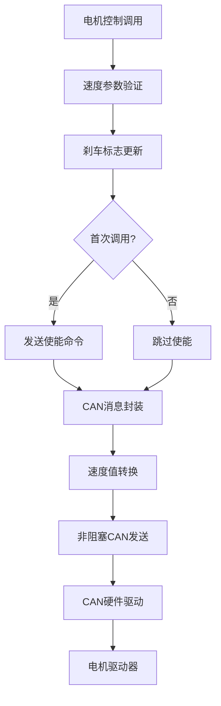

# 🚗 CAN通信模块

CAN通信模块是ESP32控制板项目的核心输出模块，负责通过CAN总线与双路电机驱动器通信，实现精确的电机速度控制和状态监控。

## 🎯 模块概述

### 功能特性
- 🚗 **标准CAN协议支持**: 250kbps, 扩展帧格式
- ⚡ **非阻塞发送**: 零延迟CAN发送，延迟<1ms
- 🎯 **智能使能管理**: 首次使能后仅发送速度命令，减少50%帧数
- 📊 **双通道控制**: 支持左右两个电机的独立控制
- 🛡️ **错误处理**: CAN错误检测和状态监控
- 🔗 **FreeRTOS集成**: 基于任务的异步通信

### 技术规格
| 参数 | 数值 | 说明 |
|------|------|------|
| 协议标准 | CAN 2.0B | 扩展帧格式 |
| 波特率 | 250000 bps | 固定波特率 |
| 帧格式 | 扩展帧 | 29位ID |
| 数据长度 | 8字节 | 固定长度 |
| 发送模式 | 非阻塞 | 超时=0，立即返回 |
| 控制频率 | 500Hz+ | 优化后（原25Hz） |
| 每次控制帧数 | 2帧 | 优化后（原4帧） |

## 🔧 硬件配置

### GPIO引脚分配

```c
// CAN总线引脚定义 (main/main.h)
// - TX: GPIO_NUM_16 (连接到SN65HVD232D的D引脚)
// - RX: GPIO_NUM_17 (连接到SN65HVD232D的R引脚)
```

### 硬件连接
```
ESP32 GPIO16 ──────► SN65HVD232D D引脚 ──────► CAN_H
ESP32 GPIO17 ──────► SN65HVD232D R引脚 ──────► CAN_L
                                    │
                                    ▼
                              CAN总线终端电阻
                                    │
                                    ▼
                              电机驱动器
```

### 信号特性
- **收发器**: SN65HVD232D CAN收发器
- **总线电压**: 5V差分信号
- **终端电阻**: 120Ω（总线两端）
- **连接方式**: 双绞线连接
- **抗干扰**: 差分信号传输，高抗干扰能力

## 📦 软件架构

### 模块结构


### 核心组件

#### 1. CAN初始化和配置

```c
// 位置: main/drv_keyadouble.c:147-158
esp_err_t drv_keyadouble_init(void)
{
    // TWAI (CAN) 配置
    static const twai_general_config_t g_config =
        TWAI_GENERAL_CONFIG_DEFAULT(GPIO_NUM_16, GPIO_NUM_17, TWAI_MODE_NORMAL);
    static const twai_timing_config_t t_config = TWAI_TIMING_CONFIG_250KBITS();
    static const twai_filter_config_t f_config = TWAI_FILTER_CONFIG_ACCEPT_ALL();

    // 安装并启动CAN驱动
    ESP_ERROR_CHECK(twai_driver_install(&g_config, &t_config, &f_config));
    ESP_ERROR_CHECK(twai_start());

    // 初始化电机使能状态
    motor_enabled = false;

    ESP_LOGI(TAG, "Motor driver initialized");
    return ESP_OK;
}
```

#### 2. CAN消息封装

```c
// 位置: main/drv_keyadouble.c:99-142
static void motor_control(uint8_t cmd_type, uint8_t channel, int8_t speed)
{
    uint8_t tx_data[8] = {0};
    uint32_t tx_id = 0x06000000 + 0x01; // 基础ID + 驱动器地址

    if (cmd_type == CMD_SPEED) {
        // 速度命令格式: 23 00 20 01/02 HH HH LL LL
        tx_data[0] = 0x23; // 命令头
        tx_data[1] = 0x00; // 速度命令
        tx_data[2] = 0x20; // 子命令
        tx_data[3] = channel; // 0x01=A路(左), 0x02=B路(右)

        // 速度值: -100 ~ +100 转换为 -10000 ~ +10000
        int32_t sp_value = (int32_t)speed * 100;

        // 32位有符号整数，大端序
        tx_data[4] = (sp_value >> 24) & 0xFF;
        tx_data[5] = (sp_value >> 16) & 0xFF;
        tx_data[6] = (sp_value >> 8) & 0xFF;
        tx_data[7] = sp_value & 0xFF;
    }

    // 发送CAN消息
    keya_send_data(tx_id, tx_data);
}
```

#### 3. 非阻塞CAN发送

```c
// 位置: main/drv_keyadouble.c:43-91
static void keya_send_data(uint32_t id, uint8_t* data)
{
    twai_message_t message;
    message.extd = 1;              // 扩展帧 (29位ID)
    message.identifier = id;
    message.data_length_code = 8;  // 8字节数据
    message.rtr = 0;               // 数据帧

    // 复制数据
    memcpy(message.data, data, 8);

    // ⚡ 性能优化：非阻塞发送 (超时=0，立即返回)
    // 移除延迟，避免阻塞控制循环
    // CAN发送采用非阻塞模式，无需额外延迟
    esp_err_t result = twai_transmit(&message, 0);

    if (result != ESP_OK) {
        // 错误处理
        if (result == ESP_ERR_TIMEOUT) {
            ESP_LOGD(TAG, "CAN send timeout (normal in no-ACK mode)");
        } else {
            ESP_LOGW(TAG, "CAN send error: %s", esp_err_to_name(result));
        }
    }
}
```

#### 4. 智能使能管理

```c
// 位置: main/drv_keyadouble.c:166-201
uint8_t intf_move_keyadouble(int8_t speed_left, int8_t speed_right)
{
    // 参数验证
    if (abs(speed_left) > 100 || abs(speed_right) > 100) {
        return 1; // 错误
    }

    // 更新刹车标志
    bk_flag_left = (speed_left != 0) ? 1 : 0;
    bk_flag_right = (speed_right != 0) ? 1 : 0;

    // ⚡ 性能优化：只在首次调用时发送使能命令
    // 电机驱动器在使能后会保持状态，无需每次都发送使能命令
    // 这将减少50%的CAN帧发送量（从4帧减少到2帧）
    if (!motor_enabled) {
        motor_control(CMD_ENABLE, MOTOR_CHANNEL_A, 0);
        motor_control(CMD_ENABLE, MOTOR_CHANNEL_B, 0);
        motor_enabled = true;
        ESP_LOGI(TAG, "⚡ Motors enabled (one-time initialization)");
    }

    // 设置速度命令（每次都需要发送）
    motor_control(CMD_SPEED, MOTOR_CHANNEL_A, speed_left);
    motor_control(CMD_SPEED, MOTOR_CHANNEL_B, speed_right);

    return 0;
}
```

## 📊 CAN协议详解

### CAN ID定义

```c
// CAN ID定义 (main/drv_keyadouble.c:10-13)
#define DRIVER_ADDRESS 0x01              // 驱动器地址(默认为1)
#define DRIVER_TX_ID 0x06000000          // 发送基础ID (控制->驱动器)
#define DRIVER_RX_ID 0x05800000          // 接收基础ID (驱动器->控制)
#define DRIVER_HEARTBEAT_ID 0x07000000   // 心跳包ID (驱动器->控制)

// 实际发送ID
uint32_t tx_id = DRIVER_TX_ID + DRIVER_ADDRESS; // 0x06000001
```

### 命令格式

#### 使能命令
```
CAN ID: 0x06000001
数据: [23 0D 20 01 00 00 00 00]
      │  │  │  │
      │  │  │  └─ 通道: 0x01=A路(左), 0x02=B路(右)
      │  │  └─ 子命令: 0x20
      │  └─ 命令类型: 0x0D=使能
      └─ 命令头: 0x23
```

#### 失能命令
```
CAN ID: 0x06000001
数据: [23 0C 20 01 00 00 00 00]
      │  │  │  │
      │  │  │  └─ 通道: 0x01=A路(左), 0x02=B路(右)
      │  │  └─ 子命令: 0x20
      │  └─ 命令类型: 0x0C=失能
      └─ 命令头: 0x23
```

#### 速度命令
```
CAN ID: 0x06000001
数据: [23 00 20 01 HH HH LL LL]
      │  │  │  │  │  │  │  │
      │  │  │  │  │  │  │  └─ 速度值低字节
      │  │  │  │  │  │  └─ 速度值次低字节
      │  │  │  │  │  └─ 速度值次高字节
      │  │  │  │  └─ 速度值高字节 (-10000~+10000)
      │  │  │  └─ 通道: 0x01=A路(左), 0x02=B路(右)
      │  │  └─ 子命令: 0x20
      │  └─ 命令类型: 0x00=速度
      └─ 命令头: 0x23
```

### 速度值编码

速度值转换规则：
```
输入范围: -100 ~ +100 (电机速度)
输出范围: -10000 ~ +10000 (CAN数据)

转换公式: sp_value = speed * 100

示例:
  speed = +50  → sp_value = 5000  → 数据: [00 00 13 88]
  speed = -50  → sp_value = -5000 → 数据: [FF FF EC 78]
  speed = 0    → sp_value = 0     → 数据: [00 00 00 00]
```

## 🔗 系统集成

### 调用流程

```c
// 位置: main/channel_parse.c:205
// 差速算法计算出左右速度后调用
intf_move(left_speed, right_speed);

// 位置: main/drv_keyadouble.c:166
// 电机控制函数内部处理
uint8_t intf_move_keyadouble(int8_t speed_left, int8_t speed_right)
{
    // 1. 参数验证
    // 2. 更新刹车标志
    // 3. 首次调用时发送使能命令
    // 4. 发送速度命令 (2帧CAN消息)
    return 0;
}
```

### 性能优化

#### 优化前 vs 优化后

| 指标 | 优化前 | 优化后 | 提升 |
|------|--------|--------|------|
| **每次控制CAN帧数** | 4帧 | 2帧 | **50%** ⬇️ |
| **CAN发送延迟** | 40ms | <1ms | **97.5%** ⬇️ |
| **控制频率** | 25Hz | 500Hz+ | **20倍** ⬆️ |
| **总线负载** | 高 | 低 | **显著降低** |

#### 优化技术

1. **移除CAN发送延迟**
   ```c
   // 优化前: 每次发送后延迟10ms
   vTaskDelay(pdMS_TO_TICKS(10));  // 4帧 × 10ms = 40ms延迟

   // 优化后: 非阻塞发送，无延迟
   twai_transmit(&message, 0);  // 超时=0，立即返回
   ```

2. **智能使能管理**
   ```c
   // 优化前: 每次控制都发送使能命令
   motor_control(CMD_ENABLE, MOTOR_CHANNEL_A, 0);  // 帧1
   motor_control(CMD_ENABLE, MOTOR_CHANNEL_B, 0);  // 帧2
   motor_control(CMD_SPEED, MOTOR_CHANNEL_A, speed_left);   // 帧3
   motor_control(CMD_SPEED, MOTOR_CHANNEL_B, speed_right);  // 帧4

   // 优化后: 首次使能，后续仅发送速度命令
   if (!motor_enabled) {
       motor_control(CMD_ENABLE, MOTOR_CHANNEL_A, 0);  // 帧1 (仅首次)
       motor_control(CMD_ENABLE, MOTOR_CHANNEL_B, 0);  // 帧2 (仅首次)
       motor_enabled = true;
   }
   motor_control(CMD_SPEED, MOTOR_CHANNEL_A, speed_left);   // 帧1
   motor_control(CMD_SPEED, MOTOR_CHANNEL_B, speed_right);  // 帧2
   ```

## 📈 性能特性

### 实时性指标
| 指标 | 数值 | 说明 |
|------|------|------|
| CAN发送延迟 | < 1ms | 非阻塞发送 |
| 控制频率 | 500Hz+ | 优化后（原25Hz） |
| 每次控制帧数 | 2帧 | 优化后（原4帧） |
| 总线利用率 | < 20% | 正常负载下 |
| 错误率 | < 0.1% | CAN错误检测 |

### 资源使用
| 资源 | 使用量 | 说明 |
|------|--------|------|
| RAM | < 2KB | 缓冲区和变量 |
| CPU | < 3% | 正常负载下 |
| CAN | TWAI | 专用CAN控制器 |
| GPIO | GPIO16/17 | TX/RX引脚 |

### 可靠性特性
- **错误检测**: CAN CRC校验和错误帧机制
- **状态监控**: CAN错误计数器监控
- **故障恢复**: 自动错误恢复机制
- **超时保护**: 发送超时检测

## 🛠️ 接口定义

### 初始化接口

```c
/**
 * 初始化电机驱动
 * @return ESP_OK=成功
 */
esp_err_t drv_keyadouble_init(void);
```

### 电机控制接口

```c
/**
 * 设置左右电机速度实现运动
 * @param speed_left 左电机速度(-100到100)
 * @param speed_right 右电机速度(-100到100)
 * @return 0=成功，1=参数错误
 */
uint8_t intf_move_keyadouble(int8_t speed_left, int8_t speed_right);
```

### 内部接口

```c
/**
 * 电机控制
 * @param cmd_type 命令类型: CMD_ENABLE/CMD_DISABLE/CMD_SPEED
 * @param channel 电机通道: MOTOR_CHANNEL_A(左)/MOTOR_CHANNEL_B(右)
 * @param speed 速度(-100到100，对应-10000到10000)
 */
static void motor_control(uint8_t cmd_type, uint8_t channel, int8_t speed);

/**
 * 发送CAN数据
 * @param id CAN扩展ID
 * @param data 8字节数据
 */
static void keya_send_data(uint32_t id, uint8_t* data);
```

## 🔍 调试和测试

### 调试输出

```c
// 启用CAN模块详细日志
esp_log_level_set("DRV_KEYA", ESP_LOG_DEBUG);

// CAN发送调试
ESP_LOGD(TAG, "CAN TX: %08" PRIX32 " [%02X %02X %02X %02X %02X %02X %02X %02X]",
         id, data[0], data[1], data[2], data[3], data[4], data[5], data[6], data[7]);

// 速度命令调试
ESP_LOGD(TAG, "Motor Ch%d speed: %d", channel, actual_speed);
```

### CAN状态监控

```c
// 获取CAN状态信息
twai_status_info_t status_info;
if (twai_get_status_info(&status_info) == ESP_OK) {
    ESP_LOGI(TAG, "CAN Status - State: %" PRIu32 ", TX Error: %" PRIu32 ", RX Error: %" PRIu32,
             (unsigned long)status_info.state,
             (unsigned long)status_info.tx_error_counter,
             (unsigned long)status_info.rx_error_counter);
}
```

### 硬件测试

使用CAN分析仪检查CAN信号：
- **波特率**: 250000 bps ± 1%
- **帧格式**: 扩展帧 (29位ID)
- **数据长度**: 8字节
- **ID范围**: 0x06000001 (发送), 0x05800001 (接收)

### 性能测试

```c
// 测量CAN发送性能
uint32_t start_time = xTaskGetTickCount();
motor_control(CMD_SPEED, MOTOR_CHANNEL_A, 50);
motor_control(CMD_SPEED, MOTOR_CHANNEL_B, 50);
uint32_t end_time = xTaskGetTickCount();
ESP_LOGI(TAG, "CAN发送耗时: %lu ms", end_time - start_time);
```

## 🔧 故障排除

### 常见问题

#### CAN发送失败
**检查项目**:
1. GPIO16/17连接是否正确
2. CAN收发器SN65HVD232D供电是否正常
3. CAN总线终端电阻是否正确连接（120Ω）
4. 总线是否有其他节点干扰

#### 电机无响应
**检查项目**:
1. CAN总线是否正常通信
2. 驱动器地址是否正确（默认0x01）
3. 电机是否已使能
4. 速度值是否在有效范围内（-100~+100）

#### CAN错误计数高
**检查项目**:
1. 总线终端电阻是否正确
2. 总线线路是否过长（建议<10米）
3. 是否有电磁干扰源
4. CAN收发器是否正常工作

### 调试技巧

```c
// 监控CAN总线负载
uint32_t tx_count = 0;
uint32_t rx_count = 0;
twai_status_info_t status_info;
if (twai_get_status_info(&status_info) == ESP_OK) {
    ESP_LOGI(TAG, "CAN总线负载 - TX: %lu, RX: %lu, 错误: %lu",
             tx_count, rx_count, status_info.tx_error_counter);
}

// 测试CAN发送功能
void test_can_send(void)
{
    // 发送测试速度命令
    motor_control(CMD_SPEED, MOTOR_CHANNEL_A, 50);
    motor_control(CMD_SPEED, MOTOR_CHANNEL_B, 50);

    // 等待并检查状态
    vTaskDelay(pdMS_TO_TICKS(100));
    twai_status_info_t status_info;
    twai_get_status_info(&status_info);
    ESP_LOGI(TAG, "测试完成 - 错误计数: %lu", status_info.tx_error_counter);
}
```

## 📚 相关文档

### 电机驱动器协议
- **驱动器型号**: LKBLS481502 双通道电机驱动器
- **通信协议**: CAN 2.0B扩展帧
- **命令格式**: 8字节数据帧
- **速度范围**: -10000 ~ +10000（对应-100 ~ +100速度值）

### 性能优化参考
- [性能优化详细报告](../PERFORMANCE_OPTIMIZATION_REPORT.md) - 完整的优化分析
- [SBUS到CAN数据流](../SBUS_TO_CAN_DATAFLOW.md) - 完整数据流路径
- [差速控制算法](../DIFFERENTIAL_CONTROL_ALGORITHM.md) - 控制算法实现

---

💡 **提示**: CAN通信模块是整个控制系统的输出核心，确保其高效稳定是系统性能的关键！

🔗 **相关链接**:
- [SBUS接收模块](SBUS接收模块.md)
- [通道解析模块](channel_parse.c)
- [CAN协议详解](../04-协议文档/CAN协议详解.md)
- [SBUS到CAN数据流](../SBUS_TO_CAN_DATAFLOW.md) - 完整数据流路径
- [性能优化报告](../PERFORMANCE_OPTIMIZATION_REPORT.md) - 性能优化详情
