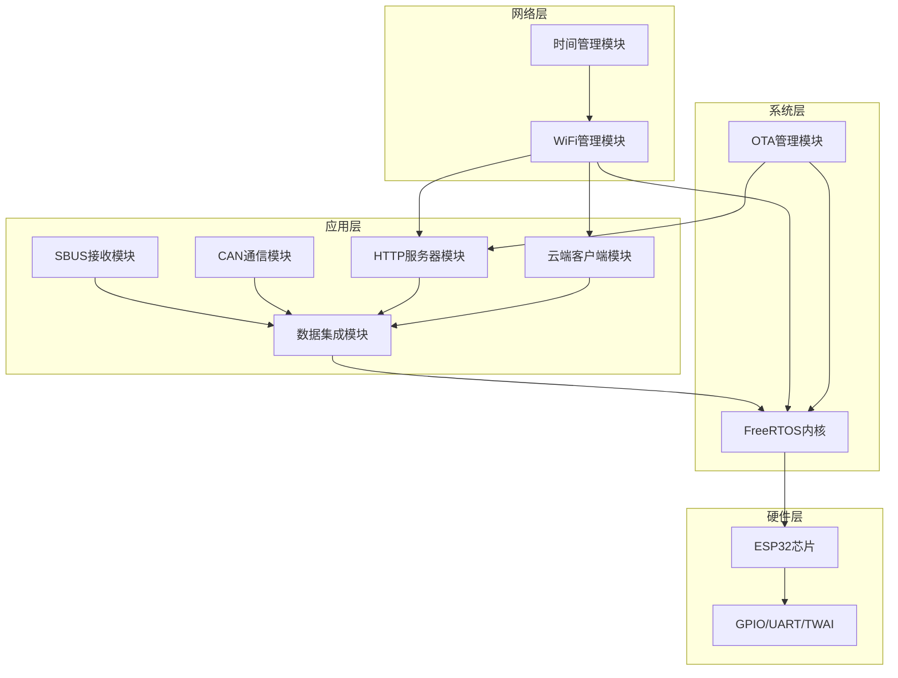
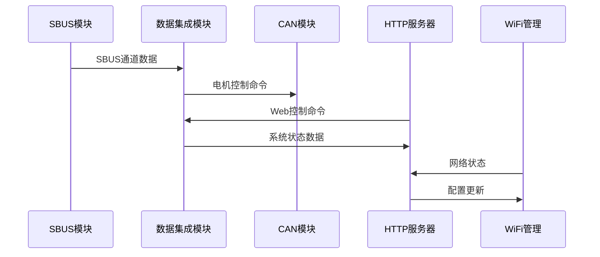

# 🔧 模块文档

本目录包含ESP32控制板项目中各个功能模块的详细说明，涵盖模块设计、接口定义、配置方法和使用指南。

## 📋 模块概览

### 🎯 核心控制模块
| 模块 | 功能 | 优先级 | 状态 |
|------|------|--------|------|
| [SBUS接收模块](SBUS接收模块.md) | 遥控信号接收和解析 | 🔴 高 | ✅ 完成 |
| [CAN通信模块](CAN通信模块.md) | 电机驱动器通信 | 🔴 高 | ✅ 完成 |

### 🌐 网络通信模块
| 模块 | 功能 | 优先级 | 状态 |
|------|------|--------|------|
| [WiFi管理模块](WiFi管理模块.md) | 无线网络连接管理 | 🟡 中 | ✅ 完成 |
| [HTTP服务器模块](HTTP服务器模块.md) | Web API和界面服务 | 🟡 中 | ✅ 完成 |
| [云端客户端模块](云端客户端模块.md) | 云服务器通信 | 🟢 低 | ✅ 完成 |

### 🔄 系统管理模块
| 模块 | 功能 | 优先级 | 状态 |
|------|------|--------|------|
| [OTA管理模块](OTA管理模块.md) | 固件无线更新 | 🟡 中 | ✅ 完成 |
| [数据集成模块](数据集成模块.md) | 数据处理和集成 | 🟢 低 | ✅ 完成 |
| [时间管理模块](时间管理模块.md) | 系统时间同步 | 🟢 低 | ✅ 完成 |

## 🏗️ 模块架构图



## 📊 模块性能指标

### 实时性要求
| 模块 | 响应时间 | 更新频率 | CPU占用 |
|------|----------|----------|----------|
| SBUS接收 | < 1ms | 71 Hz | < 5% |
| CAN通信 | < 1ms | 实时 | < 3% |
| WiFi管理 | < 100ms | 按需 | < 8% |
| HTTP服务器 | < 100ms | 按需 | < 10% |

### 内存使用
| 模块 | RAM使用 | Flash使用 | 堆栈大小 |
|------|---------|-----------|----------|
| SBUS接收 | < 1KB | < 10KB | 4KB |
| CAN通信 | < 2KB | < 15KB | 4KB |
| WiFi管理 | < 4KB | < 50KB | 4KB |
| HTTP服务器 | < 8KB | < 80KB | 8KB |
| OTA管理 | < 16KB | < 100KB | 8KB |

## 🔗 模块间通信

### 数据流向


### 队列通信机制
| 队列名称 | 发送者 | 接收者 | 数据类型 | 队列大小 |
|----------|--------|--------|----------|----------|
| sbus_queue | SBUS模块 | 数据集成 | sbus_data_t | 5 |
| cmd_queue | HTTP服务器 | 数据集成 | motor_cmd_t | 5 |
| wifi_event | WiFi管理 | HTTP服务器 | wifi_event_t | 10 |

## 🛠️ 模块开发指南

### 1. 新增模块规范

#### 文件结构
```c
// 模块头文件 (module_name.h)
#ifndef MODULE_NAME_H
#define MODULE_NAME_H

#include "esp_err.h"

// 模块配置结构
typedef struct {
    // 配置参数
} module_config_t;

// 模块状态结构
typedef struct {
    // 状态变量
} module_status_t;

// 公共接口
esp_err_t module_init(const module_config_t* config);
esp_err_t module_start(void);
esp_err_t module_stop(void);
module_status_t* module_get_status(void);

#endif
```

#### 实现文件
```c
// 模块实现文件 (module_name.c)
#include "module_name.h"
#include "esp_log.h"

static const char *TAG = "MODULE";
static module_status_t s_status = {0};

esp_err_t module_init(const module_config_t* config)
{
    ESP_LOGI(TAG, "🚀 Initializing module...");
    
    // 初始化逻辑
    
    ESP_LOGI(TAG, "✅ Module initialized successfully");
    return ESP_OK;
}
```

### 2. 接口设计原则

#### 统一错误处理
```c
// 使用ESP-IDF标准错误码
esp_err_t function_name(void)
{
    esp_err_t ret = ESP_OK;
    
    // 参数检查
    if (param == NULL) {
        return ESP_ERR_INVALID_ARG;
    }
    
    // 执行操作
    ret = some_operation();
    if (ret != ESP_OK) {
        ESP_LOGE(TAG, "Operation failed: %s", esp_err_to_name(ret));
        return ret;
    }
    
    return ESP_OK;
}
```

#### 配置管理
```c
// 使用menuconfig进行配置
#ifdef CONFIG_MODULE_ENABLE_FEATURE
    // 功能实现
#endif

// 运行时配置
typedef struct {
    bool enable_debug;
    uint32_t timeout_ms;
    uint8_t retry_count;
} module_config_t;
```

### 3. 调试和测试

#### 日志输出
```c
// 模块专用日志标签
static const char *TAG = "MODULE_NAME";

// 分级日志输出
ESP_LOGE(TAG, "❌ Critical error: %s", error_msg);
ESP_LOGW(TAG, "⚠️ Warning: %s", warning_msg);
ESP_LOGI(TAG, "ℹ️ Info: %s", info_msg);
ESP_LOGD(TAG, "🔍 Debug: %s", debug_msg);
```

#### 状态监控
```c
// 模块状态结构
typedef struct {
    bool initialized;
    bool running;
    uint32_t error_count;
    uint32_t last_update;
} module_status_t;

// 状态获取接口
module_status_t* module_get_status(void)
{
    return &s_status;
}
```

## 🔍 模块依赖关系

### 依赖层次
```
Level 4: 应用模块 (SBUS, CAN, HTTP)
    ↓
Level 3: 网络模块 (WiFi, 云端客户端)
    ↓
Level 2: 系统模块 (OTA, 数据集成, 时间管理)
    ↓
Level 1: 基础模块 (FreeRTOS, ESP-IDF)
    ↓
Level 0: 硬件层 (ESP32芯片)
```

### 初始化顺序
1. **基础系统**: NVS, 日志系统
2. **硬件驱动**: GPIO, UART, TWAI
3. **网络服务**: WiFi管理, 时间同步
4. **应用模块**: SBUS, CAN, HTTP服务器
5. **高级功能**: OTA管理, 云端客户端

## 📈 性能优化建议

### 1. 内存优化
- 使用静态分配减少碎片
- 合理设置任务栈大小
- 监控堆内存使用情况

### 2. CPU优化
- 避免阻塞操作
- 使用中断和DMA
- 优化任务优先级

### 3. 实时性优化
- 关键任务使用高优先级
- 减少任务切换开销
- 使用队列进行异步通信

## 🧪 模块测试

### 单元测试
```c
// 测试框架使用Unity
#include "unity.h"
#include "module_name.h"

void test_module_init(void)
{
    module_config_t config = {0};
    esp_err_t ret = module_init(&config);
    TEST_ASSERT_EQUAL(ESP_OK, ret);
}

void test_module_functionality(void)
{
    // 功能测试
    TEST_ASSERT_TRUE(module_is_working());
}
```

### 集成测试
- 模块间通信测试
- 性能压力测试
- 长时间稳定性测试

## 📚 学习资源

### 模块开发参考
- [ESP-IDF组件开发指南](https://docs.espressif.com/projects/esp-idf/zh_CN/latest/esp32/api-guides/build-system.html)
- [FreeRTOS任务管理](https://www.freertos.org/taskandcr.html)
- [ESP32外设驱动](https://docs.espressif.com/projects/esp-idf/zh_CN/latest/esp32/api-reference/peripherals/index.html)

### 最佳实践
- 模块化设计原则
- 接口抽象和封装
- 错误处理和恢复机制

---

💡 **提示**: 在开发新模块时，请参考现有模块的设计模式和编码规范，确保系统的一致性和可维护性！

🔗 **相关链接**:
- [系统架构文档](../06-系统架构/)
- [编码规范指南](../01-开发指南/编码规范指南.md)
- [故障排除指南](../05-故障排除/)
