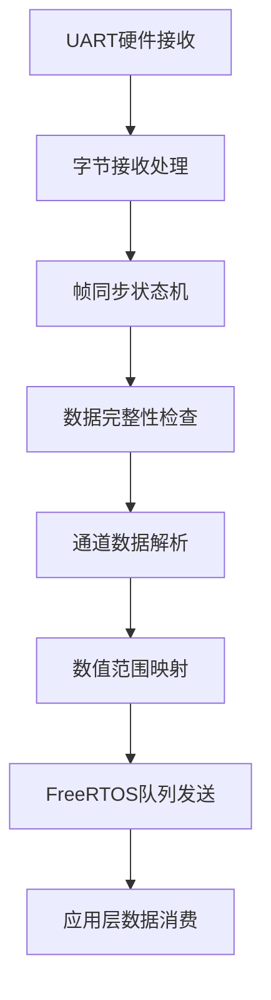

# 📡 SBUS接收模块

SBUS接收模块是ESP32控制板项目的核心输入模块，负责接收和解析来自遥控器的SBUS信号，为整个控制系统提供实时的遥控数据。

## 🎯 模块概述

### 功能特性
- 📡 **标准SBUS协议支持**: 100kbps, 8E2格式
- 🔄 **硬件信号反相**: 无需外部反相器电路
- 📊 **16通道数据解析**: 11位精度，0-2047范围
- ⚡ **实时数据处理**: 14ms更新周期，< 1ms解析延迟
- 🛡️ **数据完整性检查**: 帧头尾校验，失控检测
- 🔗 **FreeRTOS集成**: 基于队列的异步通信

### 技术规格
| 参数 | 数值 | 说明 |
|------|------|------|
| 协议标准 | SBUS | Futaba标准协议 |
| 波特率 | 100000 bps | 固定波特率 |
| 数据格式 | 8E2 | 8数据位+偶校验+2停止位 |
| 信号逻辑 | 反相 | 0V=逻辑1, 3.3V=逻辑0 |
| 帧长度 | 25字节 | 固定帧长 |
| 通道数量 | 16个 | 每通道11位精度 |
| 更新频率 | 71 Hz | 14ms周期 |

## 🔧 硬件配置

### GPIO引脚分配

<augment_code_snippet path="main/main.h" mode="EXCERPT">
````c
// UART定义
#define UART_SBUS               UART_NUM_2   // SBUS接收 (RX: GPIO_NUM_22)
````
</augment_code_snippet>

### 硬件连接
```
遥控接收器 SBUS输出 ──────► GPIO22 (UART2_RX)
                           │
                           ▼
                      ESP32内部UART
                           │
                           ▼
                      硬件信号反相
                           │
                           ▼
                      SBUS数据解析
```

### 信号特性
- **输入电压**: 3.3V TTL电平
- **信号反相**: ESP32硬件反相功能
- **连接方式**: 直连，无需外部电路
- **抗干扰**: 差分信号传输

## 📦 软件架构

### 模块结构


### 核心组件

#### 1. UART配置和初始化

<augment_code_snippet path="main/sbus.c" mode="EXCERPT">
````c
esp_err_t sbus_init(void)
{
    // SBUS协议配置：100000 bps, 8E2, 反相逻辑
    uart_config_t uart_config = {
        .baud_rate = 100000,            // SBUS标准波特率
        .data_bits = UART_DATA_8_BITS,
        .parity = UART_PARITY_EVEN,     // SBUS使用偶校验
        .stop_bits = UART_STOP_BITS_2,  // SBUS使用2停止位
        .flow_ctrl = UART_HW_FLOWCTRL_DISABLE,
        .source_clk = UART_SCLK_APB,
    };

    // 安装UART驱动
    ESP_ERROR_CHECK(uart_driver_install(UART_SBUS, 256, 256, 50, &sbus_uart_queue, 0));
    ESP_ERROR_CHECK(uart_param_config(UART_SBUS, &uart_config));
    ESP_ERROR_CHECK(uart_set_pin(UART_SBUS, UART_PIN_NO_CHANGE, GPIO_NUM_22, 
                                  UART_PIN_NO_CHANGE, UART_PIN_NO_CHANGE));

    // SBUS使用反相逻辑，硬件无反相器时必须启用软件反相
    ESP_ERROR_CHECK(uart_set_line_inverse(UART_SBUS, UART_SIGNAL_RXD_INV));
    ESP_LOGI(TAG, "🔄 Signal inversion: ENABLED (no hardware inverter)");
}
````
</augment_code_snippet>

#### 2. 数据接收任务

<augment_code_snippet path="main/sbus.c" mode="EXCERPT">
````c
/**
 * SBUS UART接收任务
 * 负责接收SBUS数据并进行帧同步
 */
static void sbus_uart_task(void *pvParameters)
{
    uart_event_t event;
    uint8_t data;
    
    ESP_LOGI(TAG, "🚀 SBUS UART task started");
    
    while (1) {
        if (xQueueReceive(sbus_uart_queue, (void *)&event, portMAX_DELAY)) {
            if (event.type == UART_DATA) {
                while (uart_read_bytes(UART_SBUS, &data, 1, 0) > 0) {
                    // 处理接收到的字节
                    sbus_receive_byte(data);
                }
            }
        }
    }
}
````
</augment_code_snippet>

#### 3. 帧同步状态机

```c
static void sbus_receive_byte(uint8_t data)
{
    g_sbus_rx_buf[g_sbus_pt] = data;
    g_sbus_pt++;
    
    // 帧头检测
    if (g_sbus_pt == 1) {
        if (data != 0x0f) {
            g_sbus_pt--; // 回退，重新等待帧头
        }
    } 
    // 帧尾检测
    else if (g_sbus_pt == 25) {
        if (data == 0x00) {
            g_sbus_pt |= 0x80; // 标记一帧数据接收完成
        } else {
            g_sbus_pt = 0; // 数据错误，重新开始
        }
    }
}
```

## 📊 SBUS协议详解

### 帧结构
```
字节位置: [0]    [1-22]      [23]    [24]
内容:     0x0F   数据字节    标志位   0x00
功能:     帧头   16通道数据   状态    帧尾
长度:     1字节  22字节      1字节   1字节
```

### 通道数据解析

<augment_code_snippet path="main/sbus.c" mode="EXCERPT">
````c
/**
 * 解析SBUS数据，按照正确的SBUS协议解析16个通道
 * SBUS协议：25字节 = [0xF0] + [data1-22] + [flags] + [0x00]
 * 每个通道11位，范围0-2047
 */
uint8_t parse_sbus_msg(uint8_t* sbus_data, uint16_t* channel)
{
    // 按照SBUS协议正确解析16个通道（每个通道11位）
    // data1-22包含16个通道的数据
    
    // 通道0: 数据字节1的低8位 + 数据字节2的低3位
    channel[0] = (sbus_data[1] >> 0 | sbus_data[2] << 8) & 0x07FF;
    
    // 通道1: 数据字节2的高5位 + 数据字节3的低6位
    channel[1] = (sbus_data[2] >> 3 | sbus_data[3] << 5) & 0x07FF;
    
    // 通道2: 数据字节3的高2位 + 数据字节4的全部 + 数据字节5的低1位
    channel[2] = (sbus_data[3] >> 6 | sbus_data[4] << 2 | sbus_data[5] << 10) & 0x07FF;
    
    // ... 继续解析其他13个通道
}
````
</augment_code_snippet>

### 位操作详解

以通道0为例说明11位数据提取：
```
原始数据: sbus_data[1] = 0xAB, sbus_data[2] = 0xCD
步骤1: sbus_data[1] >> 0 = 0xAB (取字节1的全部8位)
步骤2: sbus_data[2] << 8 = 0xCD00 (字节2左移8位)
步骤3: 0xAB | 0xCD00 = 0xCDAB (合并16位)
步骤4: 0xCDAB & 0x07FF = 提取低11位
结果: channel[0] = 11位通道值 (0-2047)
```

### 数值映射转换

```c
// SBUS原始值到标准PWM值的映射
// 输入范围：282 ~ 1722 (SBUS 11位原始值)
// 输出范围：1050 ~ 1950 (标准PWM值)
// 中位值：1500

for (int i = 0; i < LEN_CHANEL; i++) {
    channel[i] = (channel[i] - 282) * 5 / 8 + 1050;
}
```

## 🔗 系统集成

### FreeRTOS任务集成

<augment_code_snippet path="main/main.c" mode="EXCERPT">
````c
/**
 * SBUS数据处理任务
 */
static void sbus_process_task(void *pvParameters)
{
    uint8_t sbus_data[LEN_SBUS];
    uint16_t ch_val[LEN_CHANEL];
    sbus_data_t sbus_queue_data;
    
    ESP_LOGI(TAG, "SBUS处理任务已启动");
    
    while (1) {
        // 检查是否有新的SBUS数据
        if (sbus_get_data(sbus_data)) {
            // 解析SBUS数据
            if (parse_sbus_msg(sbus_data, ch_val) == 0) {
                // 复制通道数据到队列结构
                memcpy(sbus_queue_data.channel, ch_val, sizeof(ch_val));
                
                // 发送到队列，满时覆盖旧数据
                if (xQueueSend(sbus_queue, &sbus_queue_data, 0) != pdPASS) {
                    sbus_data_t dummy;
                    xQueueReceive(sbus_queue, &dummy, 0);
                    xQueueSend(sbus_queue, &sbus_queue_data, 0);
                }
            }
        }
        
        vTaskDelay(pdMS_TO_TICKS(10));
    }
}
````
</augment_code_snippet>

### 队列通信机制

```c
// 队列数据结构
typedef struct {
    uint16_t channel[LEN_CHANEL];  // 12个通道值
} sbus_data_t;

// 队列创建
sbus_queue = xQueueCreate(5, sizeof(sbus_data_t));

// 队列发送策略：满时覆盖，确保实时性
if (xQueueSend(sbus_queue, &sbus_data, 0) != pdPASS) {
    sbus_data_t dummy;
    xQueueReceive(sbus_queue, &dummy, 0);  // 取出旧数据
    xQueueSend(sbus_queue, &sbus_data, 0); // 放入新数据
}
```

## 📈 性能特性

### 实时性指标
| 指标 | 数值 | 说明 |
|------|------|------|
| 更新频率 | 71 Hz | 14ms周期 |
| 解析延迟 | < 1ms | 软件处理时间 |
| 队列延迟 | < 1ms | 任务间通信 |
| 端到端延迟 | < 5ms | 接收到控制输出 |

### 资源使用
| 资源 | 使用量 | 说明 |
|------|--------|------|
| RAM | < 1KB | 缓冲区和变量 |
| CPU | < 5% | 正常负载下 |
| UART | UART2 | 专用接收 |
| GPIO | GPIO22 | 接收引脚 |

### 可靠性特性
- **帧同步**: 自动帧头/帧尾检测
- **错误恢复**: 自动重新同步
- **数据验证**: 失控和丢帧检测
- **超时保护**: 数据超时处理

## 🛠️ 接口定义

### 初始化接口

<augment_code_snippet path="main/sbus.h" mode="EXCERPT">
````c
/**
 * 初始化SBUS接收
 * @return ESP_OK=成功
 */
esp_err_t sbus_init(void);
````
</augment_code_snippet>

### 数据获取接口

<augment_code_snippet path="main/sbus.h" mode="EXCERPT">
````c
/**
 * 获取最新的SBUS数据
 * @param sbus_data 存储SBUS数据的缓冲区
 * @return true=有新数据，false=无新数据
 */
bool sbus_get_data(uint8_t* sbus_data);
````
</augment_code_snippet>

### 解析接口

<augment_code_snippet path="main/sbus.h" mode="EXCERPT">
````c
/**
 * 解析SBUS数据，按照标准SBUS协议解析16个通道
 * @param sbus_data SBUS原始数据（25字节）
 * @param channel 输出的通道值数组（16个通道，每个通道0-2047）
 * @return 0=成功
 */
uint8_t parse_sbus_msg(uint8_t* sbus_data, uint16_t* channel);
````
</augment_code_snippet>

## 🔍 调试和测试

### 调试输出
```c
// 启用SBUS模块详细日志
esp_log_level_set("SBUS", ESP_LOG_DEBUG);

// 帧接收调试
ESP_LOGD(TAG, "📦 SBUS frame - Header: 0x%02X, Footer: 0x%02X", 
         sbus_data[0], sbus_data[24]);

// 通道数据调试
ESP_LOGD(TAG, "📊 Channels: CH0=%d CH1=%d CH2=%d", 
         channel[0], channel[1], channel[2]);
```

### 信号质量监控
```c
// 统计接收质量
static uint32_t frame_count = 0;
static uint32_t error_count = 0;

void sbus_quality_check(void)
{
    float success_rate = (float)(frame_count - error_count) / frame_count * 100;
    ESP_LOGI(TAG, "📊 SBUS Quality - Success: %.2f%% (%d/%d)", 
             success_rate, frame_count - error_count, frame_count);
}
```

### 硬件测试
使用示波器检查SBUS信号：
- **波特率**: 100000 bps ± 1%
- **电平**: 0V/3.3V (反相逻辑)
- **帧间隔**: 14ms ± 1ms
- **脉冲宽度**: 符合8E2格式

## 🔧 故障排除

### 常见问题

#### 无SBUS数据接收
**检查项目**:
1. GPIO22连接是否正确
2. SBUS信号是否为反相逻辑
3. 遥控器是否开启并绑定
4. 波特率配置是否正确

#### 数据解析错误
**检查项目**:
1. 帧头/帧尾是否正确
2. 数据长度是否为25字节
3. 校验位配置是否正确
4. 信号反相是否启用

### 调试技巧
```c
// 原始数据十六进制输出
void debug_sbus_raw_data(uint8_t* data)
{
    char hex_str[128];
    for (int i = 0; i < 25; i++) {
        sprintf(hex_str + i*3, "%02X ", data[i]);
    }
    ESP_LOGD(TAG, "Raw SBUS: %s", hex_str);
}
```

---

💡 **提示**: SBUS模块是整个控制系统的数据入口，确保其稳定可靠是系统正常运行的关键！

🔗 **相关链接**:
- [CAN通信模块](CAN通信模块.md)
- [数据集成模块](数据集成模块.md)
- [SBUS协议详解](../04-协议文档/SBUS协议详解.md)
