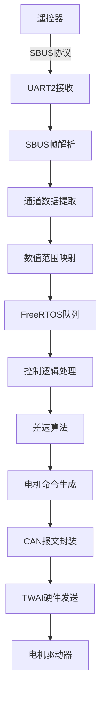

# 📡 协议文档

本目录包含ESP32控制板项目中各种通信协议的详细说明，涵盖协议规范、数据格式、解析方法和数据流分析。

## 📋 协议概览

| 协议 | 用途 | 波特率 | 数据格式 | 状态 |
|------|------|--------|----------|------|
| [SBUS协议详解](SBUS协议详解.md) | 遥控信号传输 | 100k bps | 8E2反相 | ✅ |
| [CAN协议详解](CAN协议详解.md) | 电机控制通信 | 250k bps | 扩展帧 | ✅ |
| [HTTP-API接口](HTTP-API接口.md) | Web服务接口 | HTTP/1.1 | JSON | ✅ |
| [数据流分析](数据流分析.md) | 系统数据流向 | - | 多协议 | ✅ |

## 🔄 数据流架构

## 📊 协议对比

| 协议 | 用途 | 波特率 | 数据格式 | 更新频率 | 可靠性 |
|------|------|--------|----------|----------|--------|
| SBUS | 遥控输入 | 100k bps | 8E2反相 | 14ms | 高 |
| CAN | 电机控制 | 250k bps | 扩展帧 | 实时 | 很高 |
| HTTP | Web接口 | 变长 | JSON | 按需 | 中 |
| UART | 调试输出 | 115200 bps | 8N1 | 按需 | 中 |

## ⚡ 协议特性

### SBUS协议特性
- **实时性**: 14ms更新周期，满足遥控实时性要求
- **可靠性**: 偶校验和帧头尾校验
- **兼容性**: 标准SBUS协议，兼容主流遥控器
- **抗干扰**: 反相逻辑，提高抗干扰能力

### CAN协议特性
- **高速传输**: 250kbps，满足电机控制实时性
- **错误检测**: CRC校验和错误帧机制
- **多节点**: 支持多个电机驱动器
- **优先级**: 基于ID的仲裁机制

---

💡 **提示**: 在修改协议参数时，请确保与硬件规格和系统要求保持一致！
