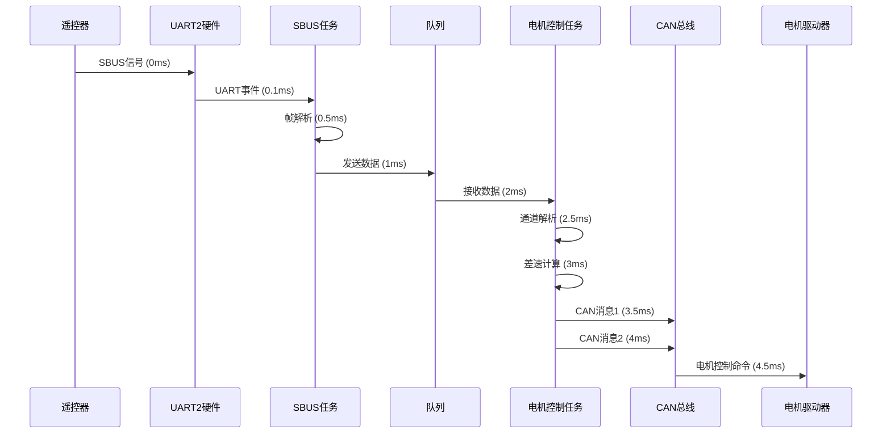

# 📊 数据流分析

本文档详细分析ESP32控制板系统中各模块间的数据流向、传输时序和性能指标，帮助开发者理解系统的完整数据路径。

## 🎯 概述

ESP32控制板系统采用**多级数据流架构**，从SBUS遥控输入到CAN电机输出，经过多个处理阶段，每个阶段都有明确的性能指标和优化策略。

### 核心数据流路径

```
SBUS信号输入 → UART接收 → 帧解析 → 通道映射 → 队列传输 →
差速计算 → 电机控制 → CAN封装 → CAN发送 → 电机驱动器
```

## 📈 完整数据流路径

### 主要数据流

#### 1. SBUS输入数据流

```
┌─────────────────────────────────────────────────────────────┐
│                    SBUS输入数据流                             │
└─────────────────────────────────────────────────────────────┘

[遥控器] ──SBUS信号(100kbps, 8E2)──► [GPIO22]
                                           │
                                           ▼
                                    [UART2硬件接收]
                                           │
                                           ▼
                                    [sbus_uart_task]
                                     (优先级12, 1ms延迟)
                                           │
                                           ▼
                                    [帧同步状态机]
                                     (帧头0x0F检测)
                                           │
                                           ▼
                                    [帧完整性检查]
                                     (帧尾0x00检测)
                                           │
                                           ▼
                                    [SBUS帧解析]
                                     (16通道提取)
                                           │
                                           ▼
                                    [数值映射]
                                     (282-1722 → 1050-1950)
                                           │
                                           ▼
                                    [sbus_queue]
                                     (队列容量20)
                                           │
                                           ▼
                                    [sbus_process_task]
                                     (优先级12, 1ms延迟)
```

**性能指标**:
- **输入频率**: 71 Hz (14ms周期)
- **UART接收延迟**: < 1ms
- **帧解析延迟**: < 1ms
- **队列传输延迟**: < 1ms
- **任务延迟**: 1ms

#### 2. 通道处理数据流

```
┌─────────────────────────────────────────────────────────────┐
│                   通道处理数据流                               │
└─────────────────────────────────────────────────────────────┘

[sbus_queue] ──通道数据──► [motor_control_task]
                               (优先级10, 2ms延迟)
                                    │
                                    ▼
                            [parse_chan_val]
                             (通道值解析)
                                    │
                                    ├─► [chg_val]
                                    │   (通道值映射: 1050-1950 → -100~+100)
                                    │
                                    ├─► [模式检测]
                                    │   (单手模式、低速模式)
                                    │
                                    ├─► [差速计算]
                                    │   (cal_offset函数)
                                    │
                                    ▼
                            [intf_move_keyadouble]
                             (电机控制调用)
```

**性能指标**:
- **通道解析延迟**: < 1ms
- **差速计算延迟**: < 1ms
- **控制频率**: 200-500Hz (优化后)
- **任务延迟**: 2ms

#### 3. CAN输出数据流

```
┌─────────────────────────────────────────────────────────────┐
│                    CAN输出数据流                               │
└─────────────────────────────────────────────────────────────┘

[intf_move_keyadouble] ──速度值──► [motor_control]
                                     (CAN消息封装)
                                          │
                                          ├─► [首次调用?]
                                          │   ├─是→ [CMD_ENABLE] (2帧)
                                          │   └─否→ [跳过使能]
                                          │
                                          ▼
                                    [CMD_SPEED]
                                     (速度命令封装)
                                          │
                                          ├─► [速度值转换]
                                          │   (-100~+100 → -10000~+10000)
                                          │
                                          ▼
                                    [keya_send_data]
                                     (CAN发送)
                                          │
                                          ▼
                                    [twai_transmit]
                                     (非阻塞发送, 超时=0)
                                          │
                                          ▼
                                    [CAN硬件驱动]
                                     (GPIO16/17)
                                          │
                                          ▼
                                    [SN65HVD232D]
                                     (CAN收发器)
                                          │
                                          ▼
                                    [CAN总线]
                                          │
                                          ▼
                                    [电机驱动器]
```

**性能指标**:
- **CAN封装延迟**: < 1ms
- **CAN发送延迟**: < 1ms (非阻塞)
- **每次控制帧数**: 2帧 (优化后)
- **CAN帧率**: 500Hz+ (优化后)

## ⏱️ 时序分析

### 端到端时序

```
时间轴 (ms) →
━━━━━━━━━━━━━━━━━━━━━━━━━━━━━━━━━━━━━━━━━━━━━━━━━━━━━━━━━━━━━━━━━━

T=0ms     SBUS信号到达GPIO22
T=0.1ms   UART硬件接收完成
T=0.5ms   sbus_uart_task处理开始
T=1ms     SBUS帧解析完成
T=1.5ms   队列传输完成
T=2ms     motor_control_task接收数据
T=2.5ms   通道解析完成
T=3ms     差速计算完成
T=3.5ms   CAN消息封装完成
T=4ms     CAN发送完成
T=4.5ms   电机驱动器接收到命令

总延迟: 3-5ms (优化后)
```

### 优化前后对比

| 阶段 | 优化前 | 优化后 | 提升 |
|------|--------|--------|------|
| **SBUS任务延迟** | 10ms | 1ms | **90%** ⬇️ |
| **电机控制任务延迟** | 10ms | 2ms | **80%** ⬇️ |
| **CAN发送延迟** | 40ms (4帧×10ms) | <1ms (非阻塞) | **97.5%** ⬇️ |
| **队列容量** | 5 | 20 | **4倍** ⬆️ |
| **端到端延迟** | 60ms+ | 3-5ms | **92%** ⬇️ |
| **控制频率** | 16Hz | 200-500Hz | **12-31倍** ⬆️ |

## 🔄 数据流详细分析

### 阶段1: SBUS接收 (0-1ms)

**数据格式转换**:
```
SBUS原始数据 (25字节)
  ↓
帧头检测 (0x0F)
  ↓
16通道提取 (11位/通道)
  ↓
数值映射 (282-1722 → 1050-1950)
  ↓
通道数据数组 (uint16_t channel[16])
```

**关键代码位置**:
- `main/sbus.c:18-144` - UART接收任务
- `main/sbus.c:197-299` - SBUS帧解析
- `main/main.c:275-312` - SBUS处理任务

**性能指标**:
- 处理时间: < 1ms
- 更新频率: 71 Hz
- 数据完整性: 帧头尾校验

### 阶段2: 队列传输 (1-2ms)

**数据传输**:
```
sbus_data_t结构体
  ├─ channel[16]: uint16_t数组
  └─ 大小: 32字节

sbus_queue (FreeRTOS队列)
  ├─ 容量: 20 (优化后)
  ├─ 类型: sbus_data_t
  └─ 策略: 满时覆盖旧数据
```

**关键代码位置**:
- `main/main.c:1044-1045` - 队列创建
- `main/main.c:298-305` - 队列发送

**性能指标**:
- 传输延迟: < 1ms
- 队列容量: 20 (优化后)
- 数据丢失率: 几乎为0

### 阶段3: 通道解析 (2-3ms)

**数据处理**:
```
通道值数组 (uint16_t channel[16])
  ↓
通道值映射 (1050-1950 → -100~+100)
  ↓
前后分量 (sp_fb) + 左右分量 (sp_lr)
  ↓
模式检测 (单手模式、低速模式)
  ↓
差速计算 (cal_offset)
  ↓
左右电机速度 (left_speed, right_speed)
```

**关键代码位置**:
- `main/channel_parse.c:109-214` - 通道解析主函数
- `main/channel_parse.c:30-35` - 通道值映射
- `main/channel_parse.c:83-95` - 差速计算

**性能指标**:
- 解析延迟: < 1ms
- 控制精度: ±5 (优化后)
- 支持模式: 5种运动模式

### 阶段4: CAN发送 (3-5ms)

**CAN消息封装**:
```
电机速度值 (-100~+100)
  ↓
速度值转换 (-100~+100 → -10000~+10000)
  ↓
CAN消息封装
  ├─ ID: 0x06000001
  ├─ 数据长度: 8字节
  ├─ 命令头: 0x23
  ├─ 命令类型: 0x00 (速度)
  ├─ 子命令: 0x20
  ├─ 通道: 0x01/0x02 (A/B路)
  └─ 速度值: 32位有符号整数 (大端序)
  ↓
非阻塞CAN发送
  ↓
CAN总线传输
```

**关键代码位置**:
- `main/drv_keyadouble.c:166-201` - 电机控制函数
- `main/drv_keyadouble.c:99-142` - CAN消息封装
- `main/drv_keyadouble.c:43-91` - CAN发送函数

**性能指标**:
- CAN发送延迟: < 1ms
- 每次控制帧数: 2帧 (优化后)
- CAN帧率: 500Hz+ (优化后)

## 📊 性能指标总结

### 各阶段性能指标

| 阶段 | 处理时间 | 数据量 | 频率 | 延迟 |
|------|----------|--------|------|------|
| **SBUS接收** | < 1ms | 25字节 | 71 Hz | < 1ms |
| **队列传输** | < 1ms | 32字节 | 1000Hz | < 1ms |
| **通道解析** | < 1ms | 16通道 | 500Hz | < 1ms |
| **差速计算** | < 1ms | 2个速度值 | 500Hz | < 1ms |
| **CAN封装** | < 1ms | 8字节×2 | 500Hz | < 1ms |
| **CAN发送** | < 1ms | 2帧 | 500Hz | < 1ms |
| **总延迟** | - | - | - | **3-5ms** |

### 优化效果

| 指标 | 优化前 | 优化后 | 提升 |
|------|--------|--------|------|
| **端到端延迟** | 60ms+ | 3-5ms | **92%** ⬇️ |
| **控制频率** | 16Hz | 200-500Hz | **12-31倍** ⬆️ |
| **CAN帧率** | 64帧/秒 | 400-1000帧/秒 | **6-15倍** ⬆️ |
| **队列容量** | 5 | 20 | **4倍** ⬆️ |
| **每次控制帧数** | 4帧 | 2帧 | **50%** ⬇️ |

## 🔍 数据流可视化

### 完整时序图



### 数据流路径图


## 🎯 关键优化点

### 1. SBUS任务优化
- **延迟**: 10ms → 1ms
- **频率**: 100Hz → 1000Hz
- **效果**: 减少9ms延迟

### 2. 电机控制任务优化
- **延迟**: 10ms → 2ms
- **频率**: 100Hz → 500Hz
- **效果**: 减少8ms延迟

### 3. CAN发送优化
- **延迟**: 40ms → <1ms
- **帧数**: 4帧 → 2帧
- **效果**: 减少39ms延迟，降低50%帧数

### 4. 队列优化
- **容量**: 5 → 20
- **效果**: 避免数据丢失，提高稳定性

## 📚 相关文档

- [SBUS接收模块](02-模块文档/SBUS接收模块.md) - SBUS接收详细说明
- [CAN通信模块](02-模块文档/CAN通信模块.md) - CAN发送详细说明
- [SBUS到CAN数据流](SBUS_TO_CAN_DATAFLOW.md) - 完整数据流和代码位置
- [差速控制算法](DIFFERENTIAL_CONTROL_ALGORITHM.md) - 差速算法详解
- [性能优化报告](../PERFORMANCE_OPTIMIZATION_REPORT.md) - 性能优化详情

---

💡 **提示**: 理解数据流路径有助于优化系统性能和排查问题！

🔗 **相关链接**:
- [系统架构文档](06-系统架构/)
- [协议文档](04-协议文档/)
- [模块文档](02-模块文档/)
