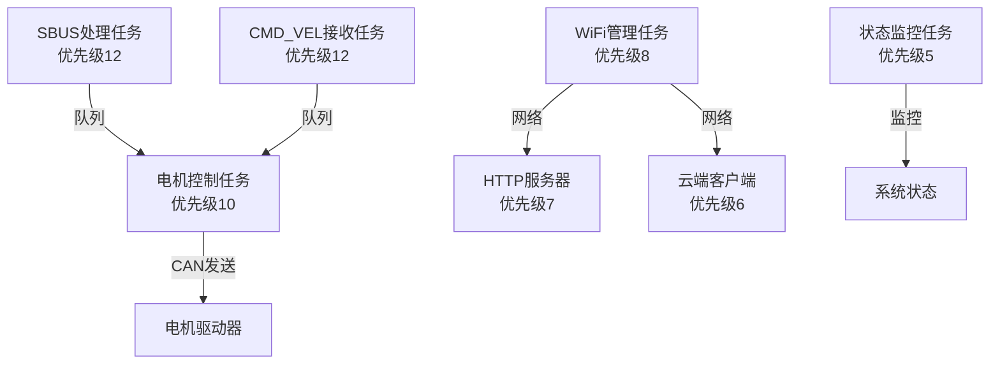

# 🔄 FreeRTOS架构

本文档详细说明ESP32控制板项目中FreeRTOS实时操作系统的架构设计、任务管理、调度策略和性能优化。

## 🎯 概述

ESP32控制板采用**FreeRTOS实时操作系统**作为软件框架，通过多任务并发、优先级调度和队列通信机制，实现实时控制和高效的系统管理。

### 核心特性
- ⚡ **实时调度**: 基于优先级的抢占式调度
- 🔄 **多任务并发**: 7个主要任务协同工作
- 📊 **队列通信**: 高效的任务间数据传递
- 🛡️ **资源管理**: 内存、互斥锁、信号量管理
- ⚡ **性能优化**: 任务延迟优化，端到端延迟仅3-5ms

## 🏗️ 系统架构

### 任务层次结构

```
优先级层次 (高 → 低)
━━━━━━━━━━━━━━━━━━━━━━━━━━━━━━━━━━━━━━━━━━━━━━━━━━━━━━━━━━━━━━━━━━

优先级12 (最高) ──┐
                  ├─► SBUS处理任务 (4KB栈)
                  └─► CMD_VEL接收任务 (2KB栈)

优先级10 (高)    ──► 电机控制任务 (4KB栈)

优先级8 (中)     ──► WiFi管理任务 (8KB栈)

优先级7 (中)     ──► HTTP服务器任务 (6KB栈) [可选]

优先级6 (低)     ──► 云端客户端任务 (4KB栈) [可选]

优先级5 (最低)   ──► 状态监控任务 (2KB栈)
```

### 任务依赖关系



## 📋 任务详细说明

### 1. SBUS处理任务

**任务信息**:
- **优先级**: 12 (最高)
- **栈大小**: 4096 字节
- **函数**: `sbus_process_task()`
- **位置**: `main/main.c:275-312`

**功能**:
- 接收SBUS数据
- 解析SBUS帧
- 提取16通道数据
- 发送到队列

**性能优化**:
```c
// 优化前: 10ms延迟
vTaskDelay(pdMS_TO_TICKS(10));

// 优化后: 1ms延迟
vTaskDelay(pdMS_TO_TICKS(1));  // 提高10倍处理频率
```

**关键代码**:
```c
static void sbus_process_task(void *pvParameters)
{
    uint8_t sbus_raw_data[LEN_SBUS] = {0};
    uint16_t ch_val[LEN_CHANEL] = {0};
    sbus_data_t sbus_data;

    while (1) {
        if (sbus_get_data(sbus_raw_data)) {
            parse_sbus_msg(sbus_raw_data, ch_val);
            memcpy(sbus_data.channel, ch_val, sizeof(ch_val));

            // 队列发送（满时覆盖旧数据）
            if (xQueueSend(sbus_queue, &sbus_data, 0) != pdPASS) {
                sbus_data_t dummy;
                xQueueReceive(sbus_queue, &dummy, 0);
                xQueueSend(sbus_queue, &sbus_data, 0);
            }
        }

        // ⚡ 性能优化：减少延迟从10ms到1ms
        vTaskDelay(pdMS_TO_TICKS(1));
    }
}
```

**性能指标**:
- **更新频率**: 1000Hz (优化后)
- **处理延迟**: < 1ms
- **队列使用**: sbus_queue (容量20)

### 2. CMD_VEL接收任务

**任务信息**:
- **优先级**: 12 (最高)
- **栈大小**: 2048 字节
- **函数**: `cmd_uart_task()`
- **位置**: `main/main.c:318-371`

**功能**:
- 接收UART命令
- 解析CMD_VEL协议
- 提取电机速度命令
- 发送到队列

**关键代码**:
```c
static void cmd_uart_task(void *pvParameters)
{
    uart_event_t event;
    uint8_t data;
    motor_cmd_t motor_cmd;

    while (1) {
        if (xQueueReceive(cmd_uart_queue, (void *)&event, portMAX_DELAY)) {
            if (event.type == UART_DATA) {
                uart_read_bytes(UART_CMD, &data, 1, portMAX_DELAY);
                // 解析命令帧...
                if (xQueueSend(cmd_queue, &motor_cmd, 0) != pdPASS) {
                    ESP_LOGW(TAG, "CMD队列已满");
                }
            }
        }
    }
}
```

### 3. 电机控制任务

**任务信息**:
- **优先级**: 10 (高)
- **栈大小**: 4096 字节
- **函数**: `motor_control_task()`
- **位置**: `main/main.c:377-422`

**功能**:
- 接收SBUS和CMD_VEL命令
- 通道值解析
- 差速计算
- 电机控制调用

**性能优化**:
```c
// 优化前: 10ms延迟
vTaskDelay(pdMS_TO_TICKS(10));

// 优化后: 2ms延迟
vTaskDelay(pdMS_TO_TICKS(2));  // 提高5倍控制频率
```

**关键代码**:
```c
static void motor_control_task(void *pvParameters)
{
    sbus_data_t sbus_data;
    motor_cmd_t motor_cmd;
    uint32_t cmd_timeout = 0;
    bool sbus_control = false;

    while (1) {
        // 优先处理CMD_VEL命令
        if (xQueueReceive(cmd_queue, &motor_cmd, 0) == pdPASS) {
            parse_cmd_vel(motor_cmd.speed_left, motor_cmd.speed_right);
            cmd_timeout = xTaskGetTickCount() + pdMS_TO_TICKS(1000);
            sbus_control = false;
        }
        // 处理SBUS数据
        else if (xQueueReceive(sbus_queue, &sbus_data, 0) == pdPASS) {
            if (sbus_control || xTaskGetTickCount() > cmd_timeout) {
                parse_chan_val(sbus_data.channel);
                sbus_control = true;
            }
        }

        // ⚡ 性能优化：减少延迟从10ms到2ms
        vTaskDelay(pdMS_TO_TICKS(2));
    }
}
```

**性能指标**:
- **控制频率**: 200-500Hz (优化后)
- **处理延迟**: < 2ms
- **队列使用**: sbus_queue, cmd_queue

### 4. WiFi管理任务

**任务信息**:
- **优先级**: 8 (中)
- **栈大小**: 8192 字节
- **函数**: `wifi_management_task()`
- **位置**: `main/main.c:428-687`

**功能**:
- WiFi连接管理
- 网络状态监控
- 连接重试逻辑
- 云客户端初始化

**关键特性**:
- 自动重连机制
- 连接超时处理
- 状态监控

### 5. HTTP服务器任务 (可选)

**任务信息**:
- **优先级**: 7 (中)
- **栈大小**: 6144 字节
- **函数**: `http_server_task()`
- **位置**: `main/main.c:694-720`
- **启用条件**: `ENABLE_HTTP_SERVER == 1`

**功能**:
- HTTP服务器管理
- Web API服务
- 状态回调设置

**注意**: 核心功能模式（CORE_FUNCTION_MODE=1）下已禁用

### 6. 状态监控任务

**任务信息**:
- **优先级**: 5 (最低)
- **栈大小**: 2048 字节
- **函数**: `status_monitor_task()`
- **位置**: `main/main.c:726-797`

**功能**:
- 系统状态监控
- 内存使用监控
- 运行时间统计

**关键代码**:
```c
static void status_monitor_task(void *pvParameters)
{
    while (1) {
        static uint32_t status_count = 0;
        status_count++;

        if (status_count % 60 == 0) {  // 每30秒输出一次
            ESP_LOGI(TAG, "📊 System status - Heap: %" PRIu32 " bytes, Uptime: %" PRIu32 "s",
                     esp_get_free_heap_size(),
                     (uint32_t)(esp_timer_get_time() / 1000000));
        }

        vTaskDelay(pdMS_TO_TICKS(500));
    }
}
```

## 📊 任务配置表

### 完整任务列表

| 任务名称 | 优先级 | 栈大小 | 函数名 | 更新频率 | 状态 |
|----------|--------|--------|--------|----------|------|
| **SBUS处理** | 12 | 4KB | `sbus_process_task` | 1000Hz (1ms) | ✅ 启用 |
| **CMD_VEL接收** | 12 | 2KB | `cmd_uart_task` | 实时 | ✅ 启用 |
| **电机控制** | 10 | 4KB | `motor_control_task` | 500Hz (2ms) | ✅ 启用 |
| **WiFi管理** | 8 | 8KB | `wifi_management_task` | 按需 | ✅ 启用 |
| **HTTP服务器** | 7 | 6KB | `http_server_task` | 按需 | ⚠️ 可选 |
| **云端客户端** | 6 | 4KB | 内部任务 | 1Hz | ⚠️ 可选 |
| **状态监控** | 5 | 2KB | `status_monitor_task` | 2Hz | ✅ 启用 |

### 核心功能模式配置

当 `CORE_FUNCTION_MODE=1` 时：
- ✅ **启用**: SBUS处理、电机控制、CMD_VEL接收、状态监控、WiFi管理
- 🚫 **禁用**: HTTP服务器、云端客户端、数据集成

## 🔄 队列通信机制

### 队列配置

| 队列名称 | 发送者 | 接收者 | 数据类型 | 容量 | 位置 |
|----------|--------|--------|----------|------|------|
| **sbus_queue** | SBUS处理任务 | 电机控制任务 | `sbus_data_t` | 20 | `main/main.c:1044` |
| **cmd_queue** | CMD_VEL任务 | 电机控制任务 | `motor_cmd_t` | 20 | `main/main.c:1045` |
| **cmd_uart_queue** | UART驱动 | CMD_VEL任务 | `uart_event_t` | 20 | `main/main.c:855` |
| **sbus_uart_queue** | UART驱动 | SBUS任务 | `uart_event_t` | 50 | `main/sbus.c:170` |

### 队列数据结构

```c
// SBUS队列数据结构
typedef struct {
    uint16_t channel[16];  // 16个通道值
} sbus_data_t;

// CMD队列数据结构
typedef struct {
    int8_t speed_left;     // 左电机速度
    int8_t speed_right;    // 右电机速度
} motor_cmd_t;
```

### 队列创建代码

```c
// 位置: main/main.c:1040-1045
// ⚡ 性能优化：增加队列大小从5到20，避免高频率控制时数据丢失
sbus_queue = xQueueCreate(20, sizeof(sbus_data_t));
cmd_queue = xQueueCreate(20, sizeof(motor_cmd_t));
```

## ⚡ 性能优化

### 任务延迟优化

| 任务 | 优化前 | 优化后 | 提升 |
|------|--------|--------|------|
| **SBUS处理** | 10ms | 1ms | **90%** ⬇️ |
| **电机控制** | 10ms | 2ms | **80%** ⬇️ |
| **CAN发送** | 40ms | <1ms | **97.5%** ⬇️ |

### 队列优化

| 队列 | 优化前 | 优化后 | 提升 |
|------|--------|--------|------|
| **sbus_queue** | 5 | 20 | **4倍** ⬆️ |
| **cmd_queue** | 5 | 20 | **4倍** ⬆️ |

### 优化效果

- **端到端延迟**: 60ms+ → 3-5ms (**92%** ⬇️)
- **控制频率**: 16Hz → 200-500Hz (**12-31倍** ⬆️)
- **CAN帧率**: 64帧/秒 → 400-1000帧/秒 (**6-15倍** ⬆️)

## 🛡️ 资源管理

### 内存管理

| 资源类型 | 使用量 | 总量 | 利用率 |
|----------|--------|------|--------|
| **任务栈** | ~28KB | 可用 | 正常 |
| **堆内存** | ~250KB | 520KB | 48% |
| **队列内存** | ~300字节 | 动态 | 正常 |

### 任务栈监控

```c
// 监控任务栈使用情况
UBaseType_t high_water_mark = uxTaskGetStackHighWaterMark(task_handle);
ESP_LOGI(TAG, "任务栈剩余: %d 字节", high_water_mark * sizeof(StackType_t));
```

### 看门狗保护

- **看门狗超时**: 默认配置
- **任务喂狗**: 关键任务定期喂狗
- **超时检测**: 任务长时间阻塞检测

## 📈 调度策略

### 优先级调度

FreeRTOS采用**抢占式优先级调度**：

1. **高优先级任务**（12-10）: 实时控制任务
   - SBUS处理、CMD_VEL接收、电机控制
   - 确保控制响应实时性

2. **中优先级任务**（8-7）: 网络服务任务
   - WiFi管理、HTTP服务器
   - 不影响核心控制功能

3. **低优先级任务**（6-5）: 后台任务
   - 云端客户端、状态监控
   - 不影响系统实时性

### 时间片轮转

相同优先级的任务采用**时间片轮转**调度：
- 时间片: 1个tick（通常10ms）
- 公平调度: 保证所有任务都有执行机会

### 中断处理

- **中断优先级**: 高于所有任务
- **中断处理**: 快速处理，避免长时间阻塞
- **中断延迟**: < 100μs

## 🔍 调试和监控

### 任务状态监控

```c
// 获取任务数量
UBaseType_t task_count = uxTaskGetNumberOfTasks();
ESP_LOGI(TAG, "当前任务数: %d", task_count);

// 获取系统运行时间
uint32_t tick_count = xTaskGetTickCount();
ESP_LOGI(TAG, "系统运行tick数: %lu", tick_count);
```

### 队列状态监控

```c
// 检查队列使用情况
UBaseType_t queue_messages = uxQueueMessagesWaiting(sbus_queue);
UBaseType_t queue_spaces = uxQueueSpacesAvailable(sbus_queue);
ESP_LOGI(TAG, "SBUS队列 - 消息数: %d, 剩余空间: %d", queue_messages, queue_spaces);
```

### 性能分析

```c
// 测量任务执行时间
uint32_t start_time = xTaskGetTickCount();
// ... 执行代码 ...
uint32_t end_time = xTaskGetTickCount();
ESP_LOGI(TAG, "执行耗时: %lu ms", (end_time - start_time) * portTICK_PERIOD_MS);
```

## 🎯 最佳实践

### 1. 任务优先级设计

- **关键路径**: 使用高优先级（10-12）
- **网络服务**: 使用中优先级（7-8）
- **后台任务**: 使用低优先级（5-6）

### 2. 栈大小配置

- **控制任务**: 4KB（足够处理复杂逻辑）
- **网络任务**: 6-8KB（需要较大栈空间）
- **监控任务**: 2KB（简单任务）

### 3. 队列使用

- **容量**: 根据数据频率设置（优化后为20）
- **超时**: 实时任务使用0超时，避免阻塞
- **覆盖策略**: 满时覆盖旧数据，确保实时性

### 4. 延迟配置

- **实时任务**: 1-2ms延迟（优化后）
- **网络任务**: 按需延迟
- **监控任务**: 500ms延迟

## 📚 相关文档

- [整体架构设计](整体架构设计.md) - 系统总体架构
- [SBUS接收模块](../02-模块文档/SBUS接收模块.md) - SBUS任务详细说明
- [CAN通信模块](../02-模块文档/CAN通信模块.md) - CAN发送详细说明
- [数据流分析](../04-协议文档/数据流分析.md) - 数据流路径分析
- [性能优化报告](../../PERFORMANCE_OPTIMIZATION_REPORT.md) - 性能优化详情

---

💡 **提示**: FreeRTOS架构设计直接影响系统实时性能，合理配置优先级和延迟是关键！

🔗 **相关链接**:
- [FreeRTOS官方文档](https://www.freertos.org/Documentation/RTOS_book.html)
- [ESP-IDF FreeRTOS指南](https://docs.espressif.com/projects/esp-idf/zh_CN/latest/esp32/api-reference/system/freertos.html)
- [系统架构文档](.)
