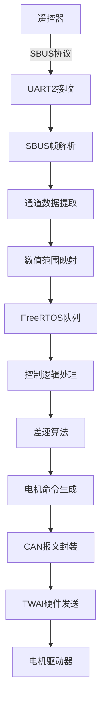

# 📡 通信协议文档

本目录包含ESP32控制板项目中各种通信协议的详细说明，涵盖协议规范、数据格式、解析方法和数据流分析。

## 📋 文档列表

### 🔄 数据流分析
- **sbus-to-can-dataflow.md** - SBUS到CAN完整信息流分析
  - SBUS硬件接收和帧解析
  - 通道数据解析和数值映射
  - 控制逻辑和差速算法
  - CAN报文生成和发送

- **data-flow-analysis.md** - 系统数据流向分析
  - 整体数据流架构
  - 各模块间数据传递
  - 数据处理和转换流程

## 🎯 协议概览

### SBUS协议
- **波特率**: 100000 bps
- **数据格式**: 8E2 (8数据位 + 偶校验 + 2停止位)
- **信号特性**: 反相逻辑
- **帧结构**: 25字节 (帧头 + 22字节数据 + 标志 + 帧尾)
- **更新频率**: 14ms/7ms

### CAN协议
- **波特率**: 250 kbps
- **帧格式**: 扩展帧 (29位ID)
- **数据长度**: 8字节
- **ID格式**: 0x06000001
- **命令类型**: 使能命令、速度命令

## 📊 协议对比

| 协议 | 用途 | 波特率 | 数据格式 | 更新频率 |
|------|------|--------|----------|----------|
| SBUS | 遥控输入 | 100k bps | 8E2反相 | 14ms |
| CAN | 电机控制 | 250k bps | 扩展帧 | 实时 |
| UART | 调试输出 | 115200 bps | 8N1 | 按需 |

## 🔄 数据流架构



## 📦 数据格式详解

### SBUS帧格式
```
字节位置: [0]    [1-22]      [23]    [24]
内容:     0x0F   数据字节    标志位   0x00
功能:     帧头   16通道数据   状态    帧尾
```

### CAN命令格式

#### 使能命令
```
[0x23, 0x0D, 0x20, channel, 0x00, 0x00, 0x00, 0x00]
```

#### 速度命令
```
[0x23, 0x00, 0x20, channel, speed_byte3, speed_byte2, speed_byte1, speed_byte0]
```

## 🔢 数值转换链

### SBUS通道解析
```
原始11位值 (282~1722) → 标准PWM值 (1050~1950)
公式: output = (input - 282) * 5 / 8 + 1050
```

### 速度值转换
```
PWM值 (1050~1950) → 速度值 (-100~+100)
公式: speed = (val - 1500) / 9 * 2
```

### CAN速度编码
```
速度值 (-100~+100) → CAN数值 (-10000~+10000)
公式: can_value = speed * 100
```

## ⚡ 协议特性

### SBUS协议特性
- **实时性**: 14ms更新周期，满足遥控实时性要求
- **可靠性**: 偶校验和帧头尾校验
- **兼容性**: 标准SBUS协议，兼容主流遥控器
- **抗干扰**: 反相逻辑，提高抗干扰能力

### CAN协议特性
- **高速传输**: 250kbps，满足电机控制实时性
- **错误检测**: CRC校验和错误帧机制
- **多节点**: 支持多个电机驱动器
- **优先级**: 基于ID的仲裁机制

## 🛡️ 错误处理

### SBUS错误处理
- 帧头校验失败 → 重新同步
- 帧尾校验失败 → 丢弃当前帧
- 数据超时 → 切换到安全模式

### CAN错误处理
- 发送失败 → 重试机制
- 总线错误 → 错误计数和恢复
- 节点离线 → 状态监控和报警

## 📈 性能指标

### 延迟指标
- **SBUS解析延迟**: < 1ms
- **队列传输延迟**: < 1ms
- **CAN发送延迟**: < 1ms
- **端到端延迟**: < 5ms

### 吞吐量指标
- **SBUS数据率**: ~71 帧/秒
- **CAN发送率**: > 1000 帧/秒
- **系统处理能力**: > 100Hz

### 可靠性指标
- **SBUS帧成功率**: > 99%
- **CAN传输成功率**: > 99.9%
- **数据完整性**: 100%

## 🔧 调试工具

### 协议分析
- SBUS帧监控和解析
- CAN总线分析仪
- 逻辑分析仪波形查看

### 性能监控
- 协议延迟测量
- 错误率统计
- 吞吐量监控

---

💡 **提示**: 在修改协议参数时，请确保与硬件规格和系统要求保持一致！
