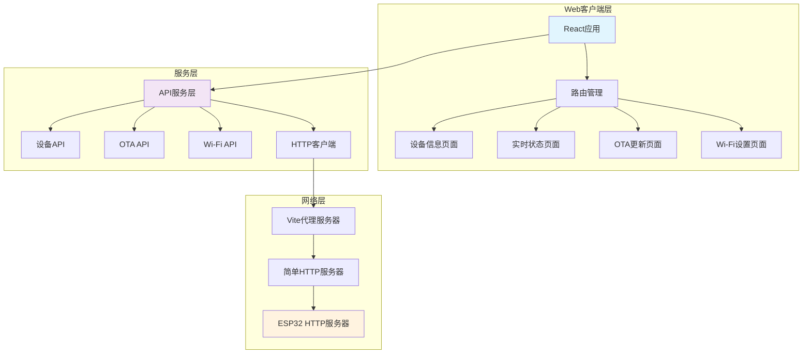
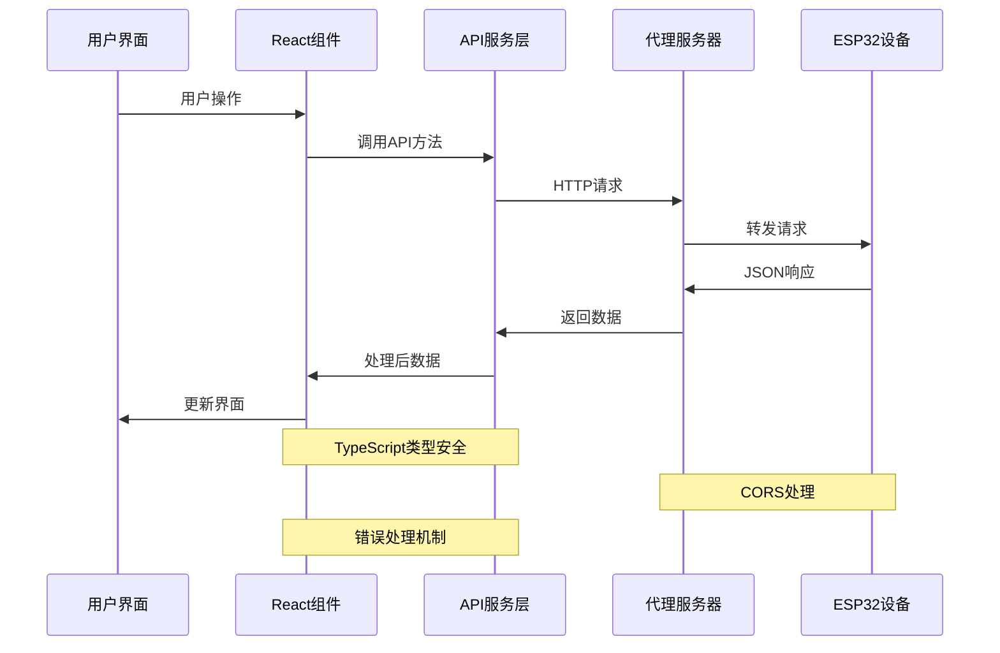
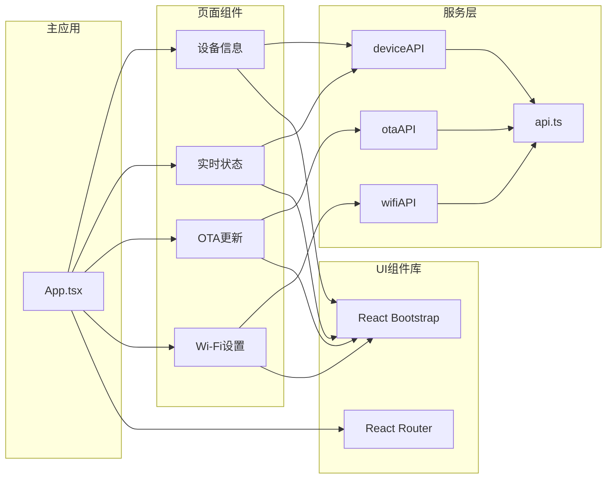

# ESP32控制板Web客户端架构文档

## 📋 目录

- [项目概述](#项目概述)
- [技术架构](#技术架构)
- [功能模块](#功能模块)
- [API设计](#api设计)
- [构建配置](#构建配置)
- [代码示例](#代码示例)
- [架构图表](#架构图表)
- [优势总结](#优势总结)

---

## 🎯 项目概述

ESP32控制板Web客户端是一个基于现代前端技术栈构建的Web上位机应用，专门为ESP32控制板系统设计。该应用提供了直观、友好的Web界面，用于监控设备状态、管理固件更新、配置网络参数等功能。

### 🌟 主要特性

- **📱 现代化界面** - 基于React + TypeScript构建的响应式Web应用
- **🔄 实时监控** - 实时显示SBUS、CAN、Wi-Fi连接状态和电机控制数据
- **🚀 OTA更新** - 支持固件无线更新，包含进度监控和回滚功能
- **📶 网络管理** - Wi-Fi网络扫描、连接管理和状态监控
- **🎨 用户友好** - 中文界面配合emoji图标，提供优秀的用户体验
- **🛡️ 类型安全** - 完整的TypeScript类型定义确保代码质量

### 🎯 应用场景

- **设备监控** - 实时查看ESP32控制板的运行状态和性能指标
- **固件管理** - 远程更新设备固件，支持版本回滚
- **网络配置** - 管理设备的Wi-Fi连接和网络参数
- **调试分析** - 监控SBUS通道数据和电机控制状态
- **系统维护** - 设备信息查看和系统资源监控

---

## 🏗️ 技术架构

### 📚 核心技术栈

#### **前端框架**
- **React 18.2.0** - 现代化UI框架，支持并发特性和自动批处理
- **TypeScript 5.2.2** - 提供类型安全和更好的开发体验
- **React Router DOM 6.8.0** - 单页应用路由管理
- **React Bootstrap 2.9.0** - 基于Bootstrap的React组件库
- **Bootstrap 5.3.0** - 响应式CSS框架

#### **构建工具**
- **Vite 5.0.8** - 下一代前端构建工具，提供极速的开发体验
- **ESLint 8.55.0** - 代码质量检查和风格统一
- **Terser 5.40.0** - JavaScript代码压缩和优化

#### **HTTP客户端**
- **Axios 1.6.0** - 功能强大的HTTP客户端库

### 📁 目录结构

```
web_client/
├── src/                    # 源代码目录
│   ├── components/         # React组件
│   │   ├── DeviceInfo.tsx     # 设备信息组件
│   │   ├── DeviceStatus.tsx   # 实时状态组件
│   │   ├── OTAUpdate.tsx      # OTA更新组件
│   │   └── WiFiSettings.tsx   # Wi-Fi设置组件
│   ├── services/          # API服务层
│   │   └── api.ts            # API接口定义和HTTP客户端
│   ├── App.tsx           # 主应用组件
│   ├── main.tsx          # 应用入口点
│   └── index.css         # 全局样式定义
├── dist/                  # 构建输出目录
│   ├── assets/              # 静态资源
│   └── index.html           # 主页面
├── node_modules/          # 依赖包目录
├── package.json          # 项目配置和依赖声明
├── vite.config.ts        # Vite构建配置
├── tsconfig.json         # TypeScript编译配置
└── simple-server.cjs     # 生产环境简单HTTP服务器
```

### 🔧 核心模块架构

#### **1. 应用入口层**
- **main.tsx** - React应用的启动入口，配置路由和全局样式
- **App.tsx** - 主应用组件，定义路由结构和导航布局

#### **2. 组件层**
- **功能组件** - 四个主要功能页面组件
- **UI组件** - 基于React Bootstrap的可复用UI组件

#### **3. 服务层**
- **API服务** - 统一的HTTP请求管理和数据类型定义
- **错误处理** - 请求拦截器和响应处理

#### **4. 样式层**
- **全局样式** - 基础样式和主题定义
- **组件样式** - 特定功能的样式定制

---

## 🧩 功能模块

### 📱 设备信息模块 (`DeviceInfo.tsx`)

#### **功能概述**
设备信息模块提供ESP32控制板的基本硬件信息、固件版本、系统资源状态等核心信息的展示。

#### **主要功能**
- **📊 基本信息展示** - 设备名称、固件版本、硬件版本、芯片型号、MAC地址
- **💾 系统资源监控** - Flash大小、可用内存、运行时间
- **🔄 自动刷新** - 每30秒自动更新设备信息
- **📖 系统说明** - 详细的功能介绍和使用说明

#### **技术特点**
- **数据格式化** - 字节单位转换、时间格式化显示
- **状态指示** - 内存不足时的警告提示
- **错误处理** - 网络异常时的友好错误提示
- **响应式布局** - 适配不同屏幕尺寸的卡片布局

### 📊 实时状态模块 (`DeviceStatus.tsx`)

#### **功能概述**
实时状态模块提供设备各个子系统的连接状态、SBUS通道数据、电机控制状态等实时信息的监控。

#### **主要功能**
- **🔗 连接状态监控** - SBUS、CAN总线、Wi-Fi连接状态实时显示
- **📡 SBUS通道数据** - 16个通道的实时数值和百分比显示
- **🚗 电机状态监控** - 左右电机速度和运行状态
- **⏱️ 时间信息** - 最后更新时间戳显示
- **🔄 自动/手动刷新** - 2秒自动刷新，支持手动刷新控制

#### **技术特点**
- **实时更新** - 高频率数据刷新确保信息实时性
- **可视化展示** - 进度条、状态指示器、颜色编码
- **数据处理** - SBUS通道值转换和百分比计算
- **交互控制** - 自动刷新开关，用户可控制更新频率

### 🔄 OTA更新模块 (`OTAUpdate.tsx`)

#### **功能概述**
OTA更新模块提供固件无线更新功能，支持文件上传、进度监控、错误处理和版本回滚。

#### **主要功能**
- **📦 固件上传** - 支持拖拽和点击选择.bin格式固件文件
- **📊 进度监控** - 实时显示上传进度和OTA更新进度
- **🛡️ 安全检查** - 文件类型验证、大小限制(1MB)
- **⚠️ 确认机制** - 更新前的确认对话框防止误操作
- **↩️ 版本回滚** - 支持回滚到上一个固件版本

#### **技术特点**
- **文件处理** - 拖拽上传、文件验证、大小检查
- **进度追踪** - 双重进度显示(上传+OTA)
- **错误恢复** - 完善的错误处理和用户提示
- **安全机制** - 多重确认防止设备损坏

### 📶 Wi-Fi设置模块 (`WiFiSettings.tsx`)

#### **功能概述**
Wi-Fi设置模块提供网络扫描、连接管理、状态监控等Wi-Fi相关的完整功能。

#### **主要功能**
- **📊 状态监控** - 当前连接状态、IP地址、信号强度显示
- **🔍 网络扫描** - 扫描可用Wi-Fi网络并显示详细信息
- **🔗 连接管理** - 输入SSID和密码连接指定网络
- **📡 信号显示** - 信号强度可视化和质量评估
- **🔄 自动刷新** - 每10秒自动更新Wi-Fi状态

#### **技术特点**
- **网络列表** - 可点击选择的网络列表界面
- **信号评估** - RSSI值转换为用户友好的信号质量描述
- **连接反馈** - 连接过程的实时状态反馈
- **安全标识** - 加密网络的安全标识显示

---

## 🔌 API设计

### 🏗️ 服务层架构

API服务层采用模块化设计，将不同功能的接口分组管理，提供统一的HTTP客户端和错误处理机制。

#### **核心配置**

<augment_code_snippet path="web_client/src/services/api.ts" mode="EXCERPT">
```typescript
// API基础配置
const API_BASE_URL = '/api'

const api = axios.create({
  baseURL: API_BASE_URL,
  timeout: 10000,
  headers: {
    'Content-Type': 'application/json',
  },
})

// 请求拦截器
api.interceptors.request.use(
  (config) => {
    console.log('API Request:', config.method?.toUpperCase(), config.url)
    return config
  },
  (error) => {
    console.error('API Request Error:', error)
    return Promise.reject(error)
  }
)
```
</augment_code_snippet>

#### **数据类型定义**

<augment_code_snippet path="web_client/src/services/api.ts" mode="EXCERPT">
```typescript
// 设备信息接口
export interface DeviceInfo {
  device_name: string
  firmware_version: string
  hardware_version: string
  chip_model: string
  flash_size: number
  free_heap: number
  uptime_seconds: number
  mac_address: string
}

// 设备状态接口
export interface DeviceStatus {
  sbus_connected: boolean
  can_connected: boolean
  wifi_connected: boolean
  wifi_ip: string
  wifi_rssi: number
  sbus_channels: number[]
  motor_left_speed: number
  motor_right_speed: number
  last_sbus_time: number
  last_cmd_time: number
}
```
</augment_code_snippet>

### 📡 API模块划分

#### **1. 设备API模块 (`deviceAPI`)**

**功能范围：** 设备基本信息和运行状态管理

**主要接口：**
- `GET /api/device/info` - 获取设备基本信息
- `GET /api/device/status` - 获取设备实时状态

**特点：**
- 高频率调用(2-30秒间隔)
- 数据量小，响应快速
- 支持实时状态监控

#### **2. OTA API模块 (`otaAPI`)**

**功能范围：** 固件更新和版本管理

**主要接口：**
- `POST /api/ota/upload` - 上传固件文件
- `GET /api/ota/progress` - 获取OTA进度
- `POST /api/ota/rollback` - 回滚固件版本

**特点：**
- 大文件上传支持
- 进度监控机制
- 错误恢复处理

#### **3. Wi-Fi API模块 (`wifiAPI`)**

**功能范围：** 网络连接和配置管理

**主要接口：**
- `GET /api/wifi/status` - 获取Wi-Fi状态
- `POST /api/wifi/connect` - 连接Wi-Fi网络
- `GET /api/wifi/scan` - 扫描可用网络

**特点：**
- 网络状态实时监控
- 连接过程状态反馈
- 网络列表管理

### 🛡️ 错误处理机制

<augment_code_snippet path="web_client/src/services/api.ts" mode="EXCERPT">
```typescript
// 响应拦截器
api.interceptors.response.use(
  (response) => {
    console.log('API Response:', response.status, response.config.url)
    return response
  },
  (error) => {
    console.error('API Response Error:', error.response?.status, error.config?.url, error.message)
    return Promise.reject(error)
  }
)

// 统一响应格式
export interface APIResponse<T> {
  status: 'success' | 'error'
  data?: T
  message?: string
}
```
</augment_code_snippet>

---

## ⚙️ 构建配置

### 🚀 Vite配置详解

<augment_code_snippet path="web_client/vite.config.ts" mode="EXCERPT">
```typescript
import { defineConfig } from 'vite'
import react from '@vitejs/plugin-react'

export default defineConfig({
  plugins: [react()],
  server: {
    port: 5173,
    host: '0.0.0.0',
    proxy: {
      '/api': {
        target: 'http://192.168.6.109',  // ESP32的IP地址
        changeOrigin: true,
        secure: false
      }
    }
  },
  build: {
    outDir: 'dist',
    assetsDir: 'assets',
    sourcemap: false,
    minify: 'terser',
    rollupOptions: {
      output: {
        manualChunks: {
          vendor: ['react', 'react-dom'],
          bootstrap: ['react-bootstrap', 'bootstrap']
        }
      }
    }
  }
})
```
</augment_code_snippet>

#### **配置特点说明**

**开发服务器配置：**
- **端口5173** - 标准Vite开发端口
- **host: '0.0.0.0'** - 允许局域网访问
- **API代理** - 自动转发API请求到ESP32设备

**构建优化配置：**
- **代码分割** - vendor和bootstrap独立打包
- **Terser压缩** - 生产环境代码压缩
- **资源优化** - 静态资源独立目录管理

### 🏭 生产环境部署

#### **简单HTTP服务器**

<augment_code_snippet path="web_client/simple-server.cjs" mode="EXCERPT">
```javascript
const server = http.createServer((req, res) => {
  // Handle API proxy
  if (req.url.startsWith('/api')) {
    const options = {
      hostname: '192.168.6.109',
      port: 80,
      path: req.url,
      method: req.method,
      headers: filteredHeaders
    };

    const proxyReq = http.request(options, (proxyRes) => {
      const responseHeaders = {
        'Content-Type': proxyRes.headers['content-type'],
        'Access-Control-Allow-Origin': '*',
        'Access-Control-Allow-Methods': 'GET, POST, PUT, DELETE, OPTIONS',
        'Access-Control-Allow-Headers': 'Content-Type, Authorization'
      };
      res.writeHead(proxyRes.statusCode, responseHeaders);
      proxyRes.pipe(res);
    });
  }

  // Serve static files from dist directory
  // ...
});
```
</augment_code_snippet>

#### **部署特点**
- **API代理** - 生产环境API请求转发
- **静态文件服务** - 服务构建后的文件
- **CORS支持** - 跨域请求处理
- **SPA路由** - 单页应用路由支持

### 📦 项目配置

#### **package.json核心配置**

<augment_code_snippet path="web_client/package.json" mode="EXCERPT">
```json
{
  "name": "esp32-control-board-web",
  "version": "1.0.0",
  "description": "ESP32控制板Web上位机界面",
  "type": "module",
  "scripts": {
    "dev": "vite",
    "build": "tsc && vite build",
    "preview": "vite preview",
    "lint": "eslint . --ext ts,tsx --report-unused-disable-directives --max-warnings 0"
  },
  "dependencies": {
    "axios": "^1.6.0",
    "bootstrap": "^5.3.0",
    "react": "^18.2.0",
    "react-bootstrap": "^2.9.0",
    "react-dom": "^18.2.0",
    "react-router-dom": "^6.8.0"
  }
}
```
</augment_code_snippet>

---

## 💻 代码示例

### 🎨 主应用组件

<augment_code_snippet path="web_client/src/App.tsx" mode="EXCERPT">
```typescript
import React from 'react'
import { Routes, Route } from 'react-router-dom'
import { Container, Navbar, Nav } from 'react-bootstrap'

function App() {
  return (
    <div className="App">
      <Navbar bg="dark" variant="dark" expand="lg" className="mb-4">
        <Container>
          <Navbar.Brand href="/">
            🎛️ ESP32控制板 Web上位机
          </Navbar.Brand>
          <Navbar.Toggle aria-controls="basic-navbar-nav" />
          <Navbar.Collapse id="basic-navbar-nav">
            <Nav className="me-auto">
              <Nav.Link href="/">设备信息</Nav.Link>
              <Nav.Link href="/status">实时状态</Nav.Link>
              <Nav.Link href="/ota">OTA更新</Nav.Link>
              <Nav.Link href="/wifi">Wi-Fi设置</Nav.Link>
            </Nav>
          </Navbar.Collapse>
        </Container>
      </Navbar>

      <Container>
        <Routes>
          <Route path="/" element={<DeviceInfo />} />
          <Route path="/status" element={<DeviceStatus />} />
          <Route path="/ota" element={<OTAUpdate />} />
          <Route path="/wifi" element={<WiFiSettings />} />
        </Routes>
      </Container>
    </div>
  )
}
```
</augment_code_snippet>

### 📊 实时状态组件示例

<augment_code_snippet path="web_client/src/components/DeviceStatus.tsx" mode="EXCERPT">
```typescript
const DeviceStatus: React.FC = () => {
  const [deviceStatus, setDeviceStatus] = useState<DeviceStatusType | null>(null)
  const [autoRefresh, setAutoRefresh] = useState(true)

  const fetchDeviceStatus = async () => {
    try {
      const status = await deviceAPI.getStatus()
      setDeviceStatus(status)
    } catch (err) {
      setError(err instanceof Error ? err.message : '获取设备状态失败')
    }
  }

  useEffect(() => {
    fetchDeviceStatus()
    if (autoRefresh) {
      const interval = setInterval(fetchDeviceStatus, 2000)
      return () => clearInterval(interval)
    }
  }, [autoRefresh])

  const getStatusBadge = (connected: boolean, label: string) => {
    return (
      <Badge bg={connected ? 'success' : 'danger'}>
        <span className={`status-indicator ${connected ? 'status-connected' : 'status-disconnected'}`}></span>
        {label}: {connected ? '已连接' : '未连接'}
      </Badge>
    )
  }
}
```
</augment_code_snippet>

### 🔄 OTA更新组件示例

<augment_code_snippet path="web_client/src/components/OTAUpdate.tsx" mode="EXCERPT">
```typescript
const handleFileSelect = (event: React.ChangeEvent<HTMLInputElement>) => {
  const file = event.target.files?.[0]
  if (file) {
    // 检查文件类型
    if (!file.name.endsWith('.bin')) {
      setError('请选择.bin格式的固件文件')
      return
    }

    // 检查文件大小 (最大1MB)
    if (file.size > 1024 * 1024) {
      setError('固件文件大小不能超过1MB')
      return
    }

    setSelectedFile(file)
    setError(null)
  }
}

const confirmUpload = async () => {
  if (!selectedFile) return

  try {
    await otaAPI.uploadFirmware(selectedFile, (progress) => {
      setUploadProgress(progress)
    })
    setSuccess(true)
  } catch (err) {
    setError(err instanceof Error ? err.message : '固件上传失败')
  }
}
```
</augment_code_snippet>

### 🎨 样式系统示例

<augment_code_snippet path="web_client/src/index.css" mode="EXCERPT">
```css
/* 状态指示器样式 */
.status-indicator {
  display: inline-block;
  width: 12px;
  height: 12px;
  border-radius: 50%;
  margin-right: 8px;
}

.status-connected {
  background-color: #28a745;
}

.status-disconnected {
  background-color: #dc3545;
}

.status-connecting {
  background-color: #ffc107;
  animation: pulse 1s infinite;
}

@keyframes pulse {
  0% { opacity: 1; }
  50% { opacity: 0.5; }
  100% { opacity: 1; }
}

/* 上传区域样式 */
.upload-area {
  border: 2px dashed #ccc;
  border-radius: 8px;
  padding: 40px;
  text-align: center;
  cursor: pointer;
  transition: border-color 0.3s;
}

.upload-area:hover {
  border-color: #007bff;
}
```
</augment_code_snippet>

---

## 📊 架构图表

### 🏗️ 系统架构图



### 🔄 数据流架构图



### 🧩 组件关系图



---

## 🌟 优势总结

### 🎯 技术优势

#### **现代化技术栈**
- **React 18** - 最新的React版本，支持并发特性和自动批处理
- **TypeScript** - 提供完整的类型安全，减少运行时错误
- **Vite** - 极速的开发体验，HMR热重载
- **ES模块** - 现代JavaScript模块系统

#### **架构设计优势**
- **模块化设计** - 清晰的分层架构，易于维护和扩展
- **组件化开发** - 可复用的React组件，提高开发效率
- **类型安全** - 完整的TypeScript接口定义
- **错误处理** - 完善的异常捕获和用户反馈机制

#### **性能优化**
- **代码分割** - vendor和bootstrap独立打包
- **资源压缩** - Terser代码压缩优化
- **懒加载** - 按需加载组件和资源
- **缓存策略** - 合理的HTTP缓存配置

### 🚀 开发优势

#### **开发体验**
- **热重载** - 代码修改实时预览
- **类型提示** - TypeScript提供完整的IDE支持
- **代码检查** - ESLint确保代码质量
- **调试友好** - 完整的Source Map支持

#### **团队协作**
- **代码规范** - 统一的ESLint配置
- **类型约束** - TypeScript接口确保API一致性
- **文档完善** - 详细的技术文档和代码注释
- **版本控制** - Git工作流程规范

#### **部署便利**
- **一键构建** - npm run build生成生产版本
- **静态部署** - 支持各种静态文件托管服务
- **环境配置** - 开发/生产环境配置分离
- **API代理** - 开发环境无缝连接ESP32

### 🎨 用户体验优势

#### **界面设计**
- **响应式布局** - 适配各种屏幕尺寸
- **现代化UI** - Bootstrap 5组件库
- **中文界面** - 本土化用户体验
- **图标丰富** - Emoji图标增强可读性

#### **交互体验**
- **实时更新** - 设备状态实时监控
- **操作反馈** - 清晰的状态指示和进度显示
- **错误提示** - 友好的错误信息和恢复建议
- **确认机制** - 重要操作的二次确认

#### **功能完整**
- **设备监控** - 全面的设备信息展示
- **固件管理** - 完整的OTA更新流程
- **网络配置** - 便捷的Wi-Fi管理
- **状态可视化** - 直观的数据展示

### 🛡️ 可靠性优势

#### **错误处理**
- **网络异常** - 超时重试和错误恢复
- **数据验证** - 前端数据格式验证
- **状态管理** - React状态一致性保证
- **用户提示** - 清晰的错误信息展示

#### **安全性**
- **文件验证** - OTA文件类型和大小检查
- **CORS处理** - 跨域请求安全配置
- **输入验证** - 用户输入数据验证
- **确认机制** - 危险操作二次确认

#### **稳定性**
- **类型安全** - TypeScript编译时错误检查
- **组件隔离** - React组件状态隔离
- **错误边界** - 组件错误不影响整体应用
- **渐进增强** - 功能模块独立，互不影响

### 📈 扩展性优势

#### **功能扩展**
- **模块化API** - 易于添加新的设备功能
- **组件复用** - 可复用的UI组件库
- **路由扩展** - 简单的页面路由添加
- **样式定制** - 灵活的CSS样式系统

#### **技术升级**
- **依赖管理** - npm包管理器便于升级
- **构建工具** - Vite支持最新的前端技术
- **框架兼容** - React生态系统丰富
- **标准遵循** - 遵循Web标准和最佳实践

这个Web客户端架构体现了现代前端开发的最佳实践，为ESP32控制板提供了专业、可靠、用户友好的Web管理界面，具有优秀的可维护性、可扩展性和用户体验。🎛️✨